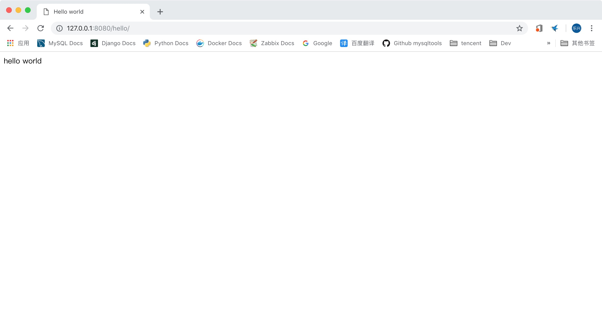
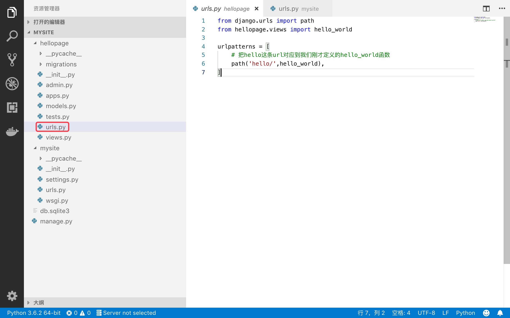
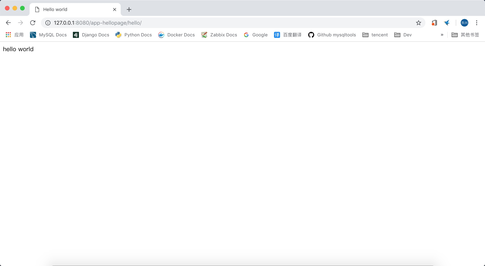
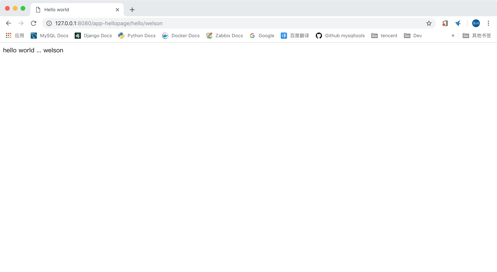
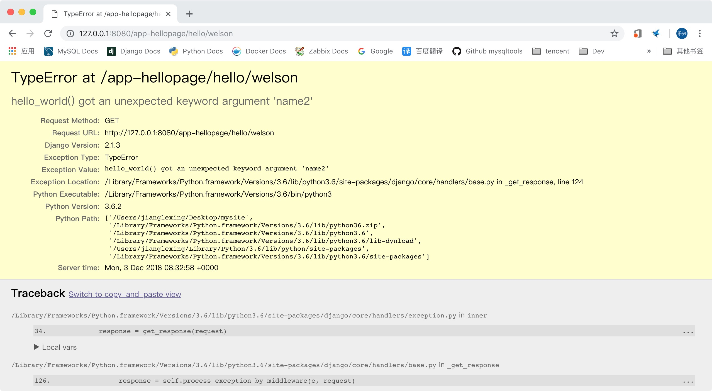

# django2docs

主编&作者:**蒋乐兴**

wechat:**jianglegege**

email:**1721900707@qq.com**

homepage:**http://www.sqlpy.com**

---

- [django处理一个请求的大致过程](#django处理一个请求的大致过程)
- [写一个helloworld页面](#写一个helloworld页面)
- [helloworld中存在的不规范](#helloworld中存在的不规范)
- [在url中指定参数](#在url中指定参数)
- [url中的参数名与视图函数中的参数名是怎么对应上的](#url中的参数名与视图函数中的参数名是怎么对应上的)
- [路径参数转化](#路径参数转化)
- [路径中参数默认值的处理方式](#路径中参数默认值的处理方式)
- [错误处理](#错误处理)
- [导入其它urlsconf](#导入其它urlsconf)
- [给视图函数传递额外参数](#给视图函数传递额外参数)
- [逆向解析url](#逆向解析url)
- [URL命名空间](#URL命名空间)

---


## django处理一个请求的大致过程
   **django在收到一条请求后 第一步：看一下这条请求的url地址 第二步：查询给定的url地址应该用哪个函数去处理 第三步：把函数的返回值传给客户端(浏览器)**

   我们把django 从url对应到函数的这个过程就叫做"URL调度"，用人话说就是根据url的不同选择不同的方法进行执行；刚才我只说了三步、事实上要比这个要复杂一点、不过知道上面的上步就可以上手了；当遇到高级功能的时候我们再把相关的内容补充好!

   ---

## 写一个helloworld页面
   **写一个返回helloworld的页面**
   
   **第一步：** 创建一个新项目叫"mysite"
   ```bash
   django-admin startproject mysite
   ```

   **第二步：** 在项目中创建一个叫"hellopage"的app
   ```bash
   cd mysite/
   python3 manage.py startapp hellopage
   ```
   整个项目的基本结构就有了
   ```bash
   ├── hellopage
   │   ├── __init__.py
   │   ├── admin.py
   │   ├── apps.py
   │   ├── migrations
   │   │   └── __init__.py
   │   ├── models.py
   │   ├── tests.py
   │   └── views.py
   ├── manage.py
   └── mysite
       ├── __init__.py
       ├── __pycache__
       │   ├── __init__.cpython-36.pyc
       │   └── settings.cpython-36.pyc
       ├── settings.py
       ├── urls.py
       └── wsgi.py
   
   4 directories, 14 files
   ```
   项目中有两个比较重要的文件在这里说一下

   **1):** hellopage/views.py 这里的就创建“视图函数”的地方、“视图函数”指的就是它返回的结果是直接给到浏览器的

   **2):** mysite/urls.py 它保存着一个"url"到"视图函数"函数的映射，也就是说url调度的核心就在这里

   **第三步：** 给hellopage/views.py 给加一个输出"hello world"的函数
   ```python
   from django.shortcuts import render
   from django.http import HttpResponse
   # Create your views here.
   
   def hello_world(request):
       """
       """
       html="""<!doctype htm>
       <html>
           <head>
               <title>Hello world</title>
           </head>
   
           <body>
               <p>hello world </p>
           </body>
       </html>
       """
   
       return HttpResponse(html)

   ```

   **第四步：** 配置url到“视图函数的对应关系”
   ```python
   from django.contrib import admin
   from django.urls import path
   
   # 导入视图函数
   from hellopage.views import hello_world
   
   urlpatterns = [
       path('admin/', admin.site.urls),
       # 把hello这条url对应到我们刚才定义的hello_world函数
       path('hello/',hello_world),
   ]
   
   ```
   **第五步：** 启动网站
   ```bash
   python3 manage.py runserver 127.0.0.1:8080
   Performing system checks...
   
   System check identified no issues (0 silenced).
   
   You have 15 unapplied migration(s). Your project may not work properly until you apply the migrations for app(s): admin, auth, contenttypes,    sessions.
   Run 'python manage.py migrate' to apply them.
   
   December 01, 2018 - 07:15:00
   Django version 2.1.3, using settings 'mysite.settings'
   Starting development server at http://127.0.0.1:8080/
   Quit the server with CONTROL-C.
   ```
   **第六步：** 通过浏览器访问网站
   

   ---

## helloworld中存在的不规范
   django中的app强调的是它的可重用性、比如你做了一个“用户管理模块”由于你水平比较高写的非常好、以至于在下一个项目中可以直接拿来就用；于是你为了用这个app你就要在你的mysite/urls.py中增加若干行代码用于表示url到视图函数的对应关系。事实上django已经为这个问题提供了解决方案

   **第一步：** 在app的目录下创建一个urls.py文件，用这个文件记录当前app中的url与视图函数的对应关系
   ```python
   from django.urls import path
   from hellopage.views import hello_world
   
   urlpatterns = [
       # 把hello这条url对应到我们刚才定义的hello_world函数
       path('hello/',hello_world),
   ]
   ```
   **第二步：** 把hellopage中的urls.py挂载到mysite/urls.py中
   ```python
   from django.contrib import admin
   from django.urls import path,include
   
   # 导入视图函数
   from hellopage.views import hello_world
   
   urlpatterns = [
       path('admin/', admin.site.urls),
       # 把hellpage这个app的url挂载到/app-hellopage子路径上
       # 当然啦“app-hellopage”是我随意选的！
       path('app-hellopage/',include('hellopage.urls')),
   ] 
   ```
   让我们来看一眼调整后的项目结构
   

   **第三步：** 通过浏览器访问页面
   

   可以看到通过这样的规范化处理后引入一个新的app理论上只要改一行代码

   **最后一个注意点** 当我们把一个新的app引入到项目中去时应该要把它注册上，不然可能会出现各种各样的“灵异事件”。在`mysite/settings.py`文件中把hellopage加上去
   ```python
    INSTALLED_APPS = [
        'django.contrib.admin',
        'django.contrib.auth',
        'django.contrib.contenttypes',
        'django.contrib.sessions',
        'django.contrib.messages',
        'django.contrib.staticfiles',
        'hellopage', # 一定要把自己用到的app给注册上去、不然你会感觉这个地球有鬼的!
    ]
   ```
   ---

## 在url中指定参数
   **django中可以方便的在url中指定参数** 还是用上面的例子的基础之上改吧

   **第一步：** 在urls.py中指定参数的“名”和参数的“类型”
   ```python
   from django.urls import path
   from hellopage.views import hello_world
   
   urlpatterns = [
       # 把hello/ 后台的所有内容识别成一个字符串，前用name来标识它
       path('hello/<str:name>',hello_world),
   ]
   ```
   **第二步：** 在视图函数中使用name参数
   ```python
   from django.shortcuts import render
   from django.http import HttpResponse
   # Create your views here.
   
   #给视图函数加一个name的参数
   def hello_world(request,name):
       """
       """
       html="""<!doctype htm>
       <html>
           <head>
               <title>Hello world</title>
           </head>
   
           <body>
               <p>hello world ... {0} </p>
           </body>
       </html>
       """
       # 格式化html的时候把name加进去
       return HttpResponse(html.format(name))
   ```
   **第三步：** 在浏览器的地址中传入"welson"

   

   ---

## url中的参数名与视图函数中的参数名是怎么对应上的
   **先说结论：** django会把url中出现的所有参数名和它值包装成\*\*kwargs来传递给视图函数、也就是说如果存在多个参数那么

   **看参数对应不上会有什么问题** 修改urls.py但是视图函数不变
   ```python
   from django.urls import path
   from hellopage.views import hello_world
   
   urlpatterns = [
       # 把hello/ 后台的所有内容识别成一个字符串，前用name2来标识它
       path('hello/<str:name2>',hello_world),
   ]
   ```
   

   ```
   Internal Server Error: /app-hellopage/hello/welson
   Traceback (most recent call last):
     File "/Library/Frameworks/Python.framework/Versions/3.6/lib/python3.6/site-packages/django/core/handlers/exception.py", line 34, in inner
       response = get_response(request)
     File "/Library/Frameworks/Python.framework/Versions/3.6/lib/python3.6/site-packages/django/core/handlers/base.py", line 126, in    _get_response
       response = self.process_exception_by_middleware(e, request)
     File "/Library/Frameworks/Python.framework/Versions/3.6/lib/python3.6/site-packages/django/core/handlers/base.py", line 124, in    _get_response
       response = wrapped_callback(request, *callback_args, **callback_kwargs)
   TypeError: hello_world() got an unexpected keyword argument 'name2'
   [03/Dec/2018 08:32:58] "GET /app-hellopage/hello/welson HTTP/1.1" 500 58314
   ```

   **为了减少不必要的坑、最好是在url中和视图函数中把参数的个数与参数的位置都给对应上**

   ---

## 路径参数转化
   **前面的内容可以看到为我们name这个参数指定了`str`这个数据类型、django中除了支持str这种数据类型之外还支持其它几种**

   **第一种： int**

   匹配“零”与“正整数”

   **第二种：str**

   匹配除了"/"之外的任意非空字符串

   **第三种：slug**

   匹配所有ASCII码中的“字符”、“数字”、“下划线”、“减号”

   **第四种：uuid**

   匹配uuid值

   **第五种：path** 
   
   它在str的基础之上加上了"/" 也就是说它可以匹配任意串，但是设立它的目标主要是为子匹配路径的

   ---

## 路径中参数默认值的处理方式
   **两个部分都要改**

   urls.py 设置为单独的两条
   ```python
   from django.urls import path
   
   from . import views
   
   urlpatterns = [
       path('blog/', views.page),
       path('blog/page<int:num>/', views.page),
   ]
   ```
   视图函数中提供参数的默认值
   ```python
   def page(request, num=1):
       # Output the appropriate page of blog entries, according to num.
    ...
   ```

   ---

## 错误处理
   **django在处理url的时候出现错误它就会调用对应错误的异常处理程序、错误是怎么和异常处理程序对应上的呢？在django中是通过变量来实现的**
   ```python
   400 –- >  django.conf.urls.handler400.
   403 –- >  django.conf.urls.handler403.
   404 –- >  django.conf.urls.handler404.
   500 –- >  django.conf.urls.handler500.
   ```
   **注意：** 这几个配置项只能配置在项目的urls.py文件中配置，配置在别的地方无效mysite/urls.py 内容如下：
   ```python
   from django.conf.urls import url
   from django.contrib import admin
   from django.http import HttpResponse
   from django.conf.urls import handler404
   
   def fun_for_404(request):
       html="""<!doctype htm>
       <html>
           <head>
               <title>404 Not Found</title>
           </head>
   
           <body>
               <p>404 Not Found ... Powered by jianglexing </p>
           </body>
       </html>
       """  
   
       return HttpResponse(html)
   # 也就是说把对应的handlerxxx 设置为对象的视图函数就行
   handler404 = fun_for_404
   
   urlpatterns = [
       url(r'^admin/', admin.site.urls),
   ]
   ```
   **同样的代码在django-2.1.3中会错500错误、这样的表现与官方文档说的不一样呀；应该是个bug了吧**

   

   ---

## 导入其它urlsconf
   **最佳的实践是给每一个app都增加它自己的urls.py，然后在项目中导入这个urls.py**

   ```python
   from django.urls import include, path
   
   urlpatterns = [
       # ... snip ...
       path('community/', include('aggregator.urls')),
       path('contact/', include('contact.urls')),
       # ... snip ...
   ]
   ```
   ---

## 给视图函数传递额外参数
   **方法就是在path中直接指定** 
   ```python
   from django.urls import path
   from . import views
   
   urlpatterns = [
       path('blog/<int:year>/', views.year_archive, {'foo': 'bar'}),
   ]
   ```
   如果是`include`的方式引入的也是一样的
   ```python
   from django.urls import include, path
   
   urlpatterns = [
       path('blog/', include('inner'), {'blog_id': 3}),
   ]
   ```
   ---

## 逆向解析url
   **前的内容都是有用到urlpatterns这个对象里面记录了url与视图函数之间的对应关系，逆向解析指的是从url的名字出发得到url的字符串**
   ```python
   from django.urls import path
   
   from . import views
   
   urlpatterns = [
       #...
       path('articles/<int:year>/', views.year_archive, name='news-year-archive'), #一定要给path传递name参数
       #...
   ]
   ```
   **用法一：** 在模板中逆向解析用url标签
   ```html
   <a href="">2012 Archive</a>
   {# Or with the year in a template context variable: #}
   <ul>
   
   <li><a href="">{{ yearvar }} Archive</a></li>
   
   </ul>
   ```
   **用法二：** 在python代码中使用reverse函数
   ```python
   from django.http import HttpResponseRedirect
   from django.urls import reverse
   
   def redirect_to_year(request):
       # ...
       year = 2006
       # ...
       return HttpResponseRedirect(reverse('news-year-archive', args=(year,)))
   ```

   ---
   
## URL命名空间
   **URL命名空间这个主题通常也不怎么用省了(主要是我不会用 (- v -) ) 官方地址：**https://docs.djangoproject.com/en/2.1/topics/http/urls/ 

   --- 
   