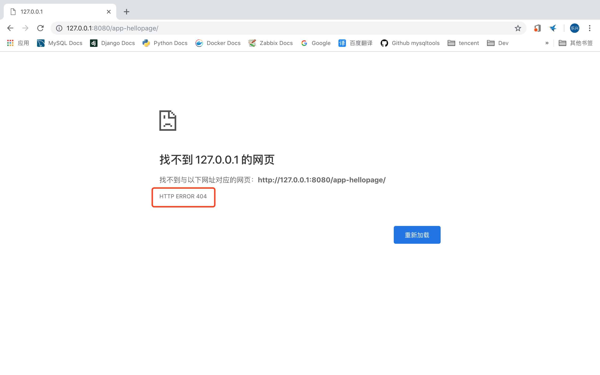
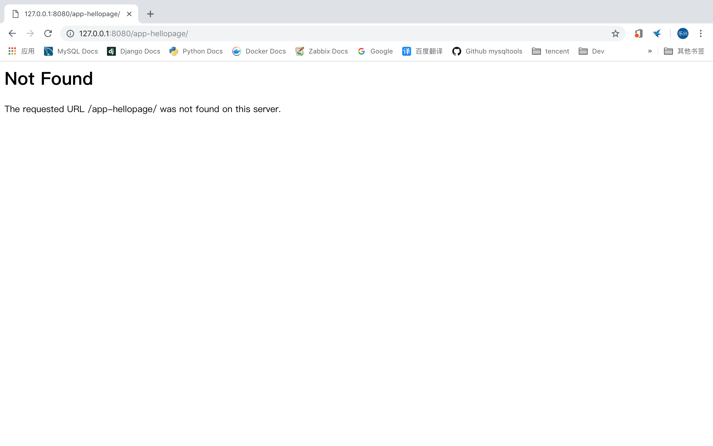

# django2docs

主编&作者:**蒋乐兴**

wechat:**jianglegege**

email:**1721900707@qq.com**

homepage:**http://www.sqlpy.com**

---

- [视图函数是什么](#视图函数是什么)
- [视图函数返回http错误码](#视图函数返回http错误码)
- [自定义http错误码对应的视图](#自定义http错误码对应的视图)
---


## 视图函数是什么
   **服务器接收客户端的请求，处理请求并返回响应 这整个处理流程的一个物理表现就叫“视图函数”，在django中通常是以一个函数的形式的表现**

   **一个接收客户端请求并返回hello world的“视图函数”**
   ```python
   from django.shortcuts import render
   from django.http import HttpResponse
   # Create your views here.
   
   def hellopage(request):
       """
       """
       html="""<!doctype htm>
       <html>
           <head>
               <title>Hello world</title>
           </head>
   
           <body>
               <p> hello world </p>
           </body>
       </html>
       """
       # 格式化html
       return HttpResponse(html.format(html))
   ```

   视图函数的特点：

   **1):视图函数的第一个参数用来接收请求对象、通常会把这个参数的名字定为request**

   ---

## 视图函数返回http错误码
   **视图函数可以方便的返回http的状态码、比如说404 500等等**
   ```python
   from django.http import HttpResponse
   def hellopage(request):
       """
       """
       html="""<!doctype htm>
       <html>
           <head>
               <title>Hello world</title>
           </head>
   
           <body>
               <p> hello world </p>
           </body>
       </html>
       """
       # 格式化html
       # return HttpResponse(html.format(html))
       # 强制的返回404
       return HttpResponse(status=404)
   ```
   通过浏览器查询
   

   **事实上对于404 500这类的常见错误码django已经定义好了对应的HttpRessponse子类型了**
   ```python
   from django.shortcuts import render
   from django.http import HttpResponse,HttpResponseNotFound
   # Create your views here.
   
   def hellopage(request):
       """
       """
       html="""<!doctype htm>
       <html>
           <head>
               <title>Hello world</title>
           </head>
   
           <body>
               <p> hello world </p>
           </body>
       </html>
       """
       # 格式化html
       # return HttpResponse(html.format(html))
       # 强制的返回404
       return HttpResponseNotFound()
   ```

   ---

## http404异常
   **为了统一全站的404、django专门为404错误提供了一个异常、并会在全局层面对它做错误处理**
   ```python
   from django.shortcuts import render
   from django.http import HttpResponse,HttpResponseNotFound,Http404
   # Create your views here.
   
   def hellopage(request):
       """
       """
       html="""<!doctype htm>
       <html>
           <head>
               <title>Hello world</title>
           </head>
   
           <body>
               <p> hello world </p>
           </body>
       </html>
       """
       # 格式化html
       # return HttpResponse(html.format(html))
   
       # 强制的返回404
       #return HttpResponseNotFound()
   
       # 直接报http404
       raise Http404("你要想的页面已经丢了!")
   ```
   **为什么说raise Http404实例会怎么系统的异常处理：** 原因是对于Http404这类的异常django会作全局的错误处理、也不是说不管哪个app中的Http404在整个项目层面它们共用同一份错误处理代码。这样就方便了统一各个网站的错误页面

   

   ---


## 自定义http错误码对应的视图
   **通过设置对应处理程序的值为对应的视图函数就可以达到针对特定错误进行处理的目的** 以处理404为例子，注意这些设置一定要在根urlconf中给定！
   ```python
   from django.contrib import admin
   from django.urls import path,include
   
   from django.conf.urls import handler404
   from django.http import HttpResponse
   
   def deal_with_404(request):
       """
       """
       html = """<!doctype html>
       <html>
           <head>
               <title>这个是全局404处理页面</title>
           </head>
   
           <body>
               <p>全局404处理页面</p>
           </body>
       </html>
       """
       return HttpResponse(html)
   
   handler404 = deal_with_404
   
   urlpatterns = [
       path('admin/', admin.site.urls),
       path('app-hellopage/',include('hellopage.urls')),
   ]
   ```
   ****