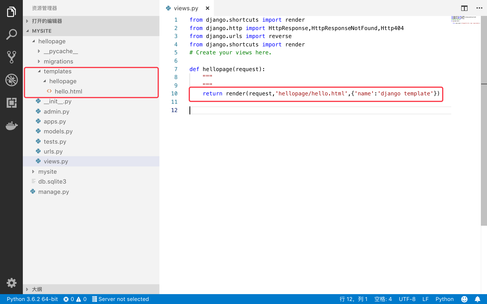
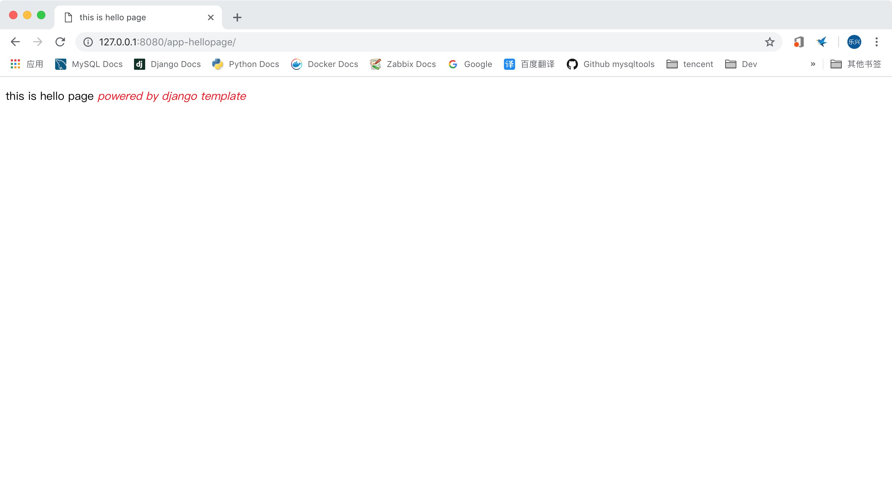

# django2docs

主编&作者:**蒋乐兴**

wechat:**jianglegege**

email:**1721900707@qq.com**

homepage:**http://www.sqlpy.com**

---

- [简介](#简介)
- [为django项目引入模板](#为django项目引入模板)
- [render](#render)
- [引入模板有什么好处](#引入模板有什么好处)
- [redirect](#redirect)
- [get_object_or_404](#get_object_or_404)
- [get_list_or_404](#get_list_or_404)

---


## 简介
   **django是基于MVC三层架构的、这个就使得查询数据 --> 适当处理 --> 渲染模板 --> 返回渲染内容给客户端；这个处理流程会不断的被调用，如果每一个view都按这个流程写一次那么整个django项目中会有大量的“样板”代码！ 为了减少“样板”代码django把常用的逻辑打包在了django.shortcuts这个包中。介于django.shortcuts这个包的定位所以通常它里面的函数是跨MVC三层的**

   **虽然模板相关的内容是下一章节的内容，这里还是直接带入算了**

   ---

## 为django项目引入模板
   **每一个app都可以有自己的html模板文件、也可以有整个项目级别的模板**

   **1): django项目的默认模板配置** 
   ```python
   TEMPLATES = [
       {
           'BACKEND': 'django.template.backends.django.DjangoTemplates',
           'DIRS': [],
           'APP_DIRS': True, # 这里的True的意思是说django会在app的templates目录下模板、不幸的是这个目录是要自己加的.
           'OPTIONS': {
               'context_processors': [
                   'django.template.context_processors.debug',
                   'django.template.context_processors.request',
                   'django.contrib.auth.context_processors.auth',
                   'django.contrib.messages.context_processors.messages',
               ],
           },
       },
   ]
   ```
   **2): 在app中增加templates** 由于每一个app在进行模板查询的时候都是基于templates这个相对路径来找的，所以有多们app的情况下就有可能造成混乱；为了避免这种情况的发生我们通常是要在templates目录中加一个app的同名目录
   ```bash
   cd hellopage/
   mkdir -p templats/hellopage
   ```
   

   **3): 在模板目录中增加html模板文件hello.html**
   ```html
   <!doctype html>
   <html>
       <head>
           <title>this is hello page </title>
           <meta charset="utf8">
   
           <style>
               em {color:red;}
           </style>
       </head>
   
       <body>
           <p>this is hello page <em>powered by {{name}}</em></p>
       </body>
   </html>
   ```
   可以看到html模板文件中大致上还是html语言、但是也有例外；比如在上面的代码中就出现了`<em>powered by {{name}}</em>` 这里的`{{name}}`类似于format中的占位符；只是django的模板语法相比format不知道要高到哪里去了！虽然这里没有体现出来

   ---


## render
   **用给定的数据上下文，渲染给定的模板，返回HttpResponse对象**
   ```python
   render(request, template_name, context=None, content_type=None, status=None, using=None)
   ```
   **request:** 请求对象

   **template_name:** 模板文件路径

   **context:** 数据上下文

   **content_type:** 用于设置返回对象的MiME Type

   **status:** 返回对象的http状态码 默认是200

   **using:** 指定用哪个模板引擎

   用render函数来重写之前的helloword页面吧
   ```python
   from django.shortcuts import render
   # Create your views here.
   
   def hellopage(request):
       """
       """
       return render(request,'hellopage/hello.html',{'name':'django template'})
   ```
   大兄弟这一行代码就OK了？ 从浏览器查看
   

   ---
   
## 引入模板有什么好处
   **一句话就是表现与逻辑分离** 也就是说如果你哪天想改html样式或结果的时候可以完全不用去改python代码，也就是说前后端可以在一定程度上分离

   ---

## redirect
   **用于处理重定向**
   ```python
   redirect(to, permanent=False, *args, **kwargs)
   ```
   **to:** 重定向的目标

   **permanent:** 是否是永久重定向

   **1):** to可以是一个obj这种情况下会调用obj的 get_absolute_url() 方法
   ```python
   from django.shortcuts import redirect
   
   def my_view(request):
       ...
       obj = MyModel.objects.get(...)
       return redirect(obj)
   ```
   **2):** to可以是一个可以被reverse正常解析的url名
   ```python
   def my_view(request):
       ...
       return redirect('some-view-name', foo='bar')
   ```
   **3):** 硬编码的路径(相对路径和全路径都是可以的)
   ```python
   def my_view(request):
       ...
       return redirect('/some/url/')

   def my_view(request):
       ...
       return redirect('https://example.com/')
   ```

   ---

## get_object_or_404
   **查询Model实例、如果没能找到满足给定条件的实例就直接报404错误**
   ```python
   get_object_or_404(klass, *args, **kwargs)
   ```
   **klass:** 可以是Model、Manager、也可以是Queryset

   **\*\*kwargs:** 任何关系字参数只要它用在get()、filter()没有问题就行

   在没有这个shortcut之前我们是这样做的
   ```python
   from django.http import Http404
   
   def my_view(request):
       try:
           obj = MyModel.objects.get(pk=1)
       except MyModel.DoesNotExist:
           raise Http404("No MyModel matches the given query.")
   ```
   通过get_object_or_404可以减化代码
   ```python
   from django.shortcuts import get_object_or_404
   
   def my_view(request):
       obj = get_object_or_404(MyModel, pk=1)
   ```
   不一定要传入Model对象、get_object_or_404也支持用queryset对象
   ```python
   queryset = Book.objects.filter(title__startswith='M')
   get_object_or_404(queryset, pk=1)
   ```
   出于QuerySet与Manager之间的关系、我们也可以直接传说Manager对象
   ```python
   author = Author.objects.get(name='Roald Dahl')
   get_object_or_404(author.book_set, title='Matilda')
   ```

   ---

## get_list_or_404
   **与get_object_or_404差不多，唯一不同的是get_list_or_404是要查询一系列对象而不是单一对象**
   ```python
   get_list_or_404(klass, *args, **kwargs)
   ```
   没有这个shortcut之前：
   ```python
   from django.http import Http404
   
   def my_view(request):
       my_objects = list(MyModel.objects.filter(published=True))
       if not my_objects:
           raise Http404("No MyModel matches the given query.")
   ```
   有了get_list_or_404之后：
   ```python
   from django.shortcuts import get_list_or_404
   
   def my_view(request):
       my_objects = get_list_or_404(MyModel, published=True)
   ```

   ---


