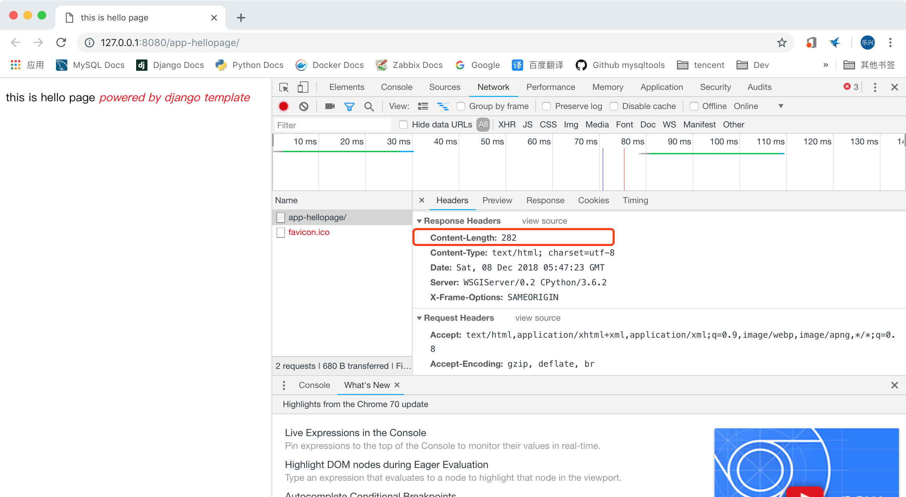
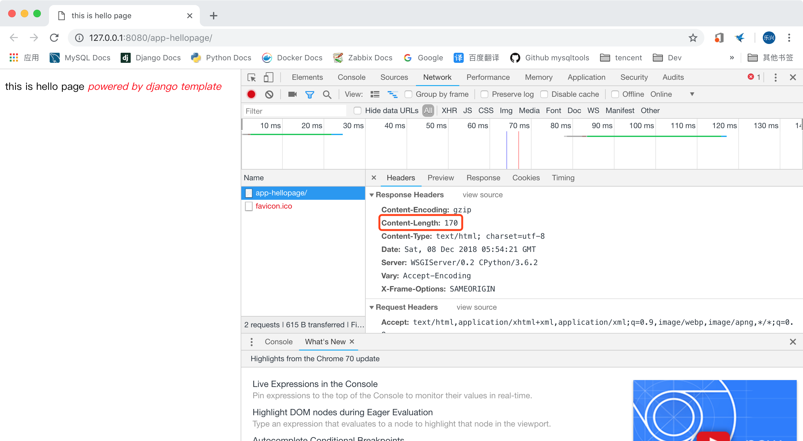
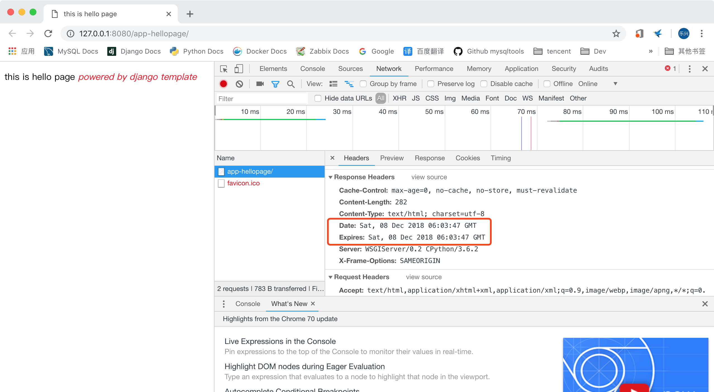
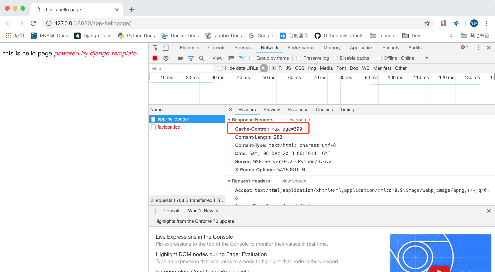

# django2docs

主编&作者:**蒋乐兴**

wechat:**jianglegege**

email:**1721900707@qq.com**

homepage:**http://www.sqlpy.com**

---

- [简介](#简介)
- [require_http_methods](#require_http_methods)
- [gzip_page](#gzip_page)
- [never_cache](#never_cache)
- [cache_control](#cache_control)
---


## 简介
   **django通过装饰器来为视图函数提供多种http特性的支持**

   ---


## require_http_methods
   **这个装饰器用来限定http请求的方法、如果客户端以不允许的方法请求了服务端就会报405错误**
   ```python
   require_http_methods(request_method_list)
   ```
   例子：让view只支持GET请求
   ```python
   from django.views.decorators.http import require_http_methods
   # Create your views here.
   
   @require_http_methods(['GET'])
   def hellopage(request):
       """
       """
       return render(request,'hellopage/hello.html',{'name':'django template'})
   ```
   **要注意的地方：** http请求方法要用大字表示、就算只有一个也要放入“列表”中传递

   如果你也和我一样感觉传递一个列表不是我们想要看到的、那么这几个装饰器应该适合你

   **require_GET：** 只支持GET

   **require_POST：** 只支持POST

   **require_safe：** 支持HEAD & GET 两个方法

   ```python
   @require_POST
   def hellopage(request):
       """
       """
       return render(request,'hellopage/hello.html',{'name':'django template'})
   ```

   ---


## gzip_page
   **用于压缩视图函数的response返回**

   末压缩：
   ```python
   def hellopage(request):
       """
       """
       return render(request,'hellopage/hello.html',{'name':'django template'})
   ```
    
   可以看到返回的内容长度为282字节、下面看一下压缩后有多少吧!

   ```python
   from django.views.decorators.gzip import gzip_page
   # Create your views here.
   
   @gzip_page
   def hellopage(request):
       """
       """
       return render(request,'hellopage/hello.html',{'name':'django template'})
   ```
    

   ---

## never_cache
   **告诉客户端不要缓存结果、原为结果马上就会过期**
   ```python
   from django.views.decorators.cache import cache_control,never_cache
   # Create your views here.
   
   @never_cache
   def hellopage(request):
       """
       """
       return render(request,'hellopage/hello.html',{'name':'django template'})
   ```
    

   ---

## cache_control
   **这个用来控制客户端缓存的行为、以下例子告诉浏览器最长可以缓存300秒**
   ```python
   from django.views.decorators.cache import cache_control,never_cache
   # Create your views here.
   
   @cache_control(max_age=300)
   def hellopage(request):
       """
       """
       return render(request,'hellopage/hello.html',{'name':'django template'})
   ```
   

   可以看到在返回的Response中就设置了cache_control : max-age=300

   ---
