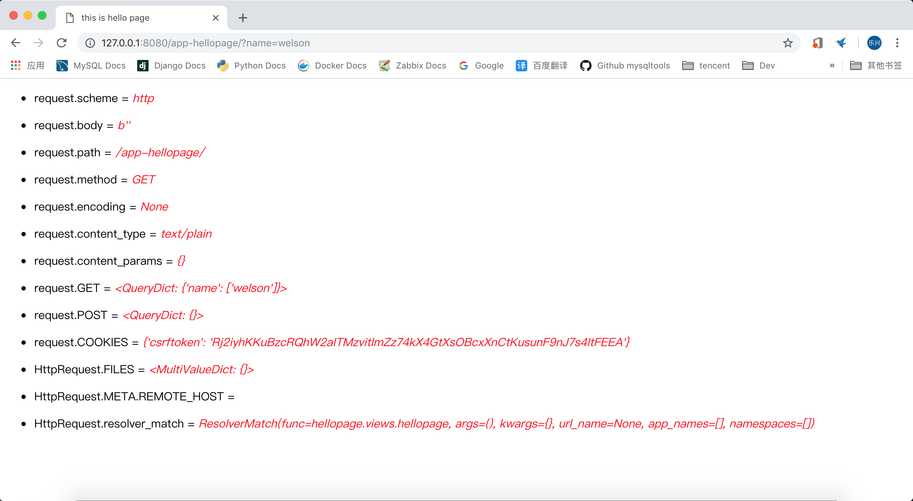
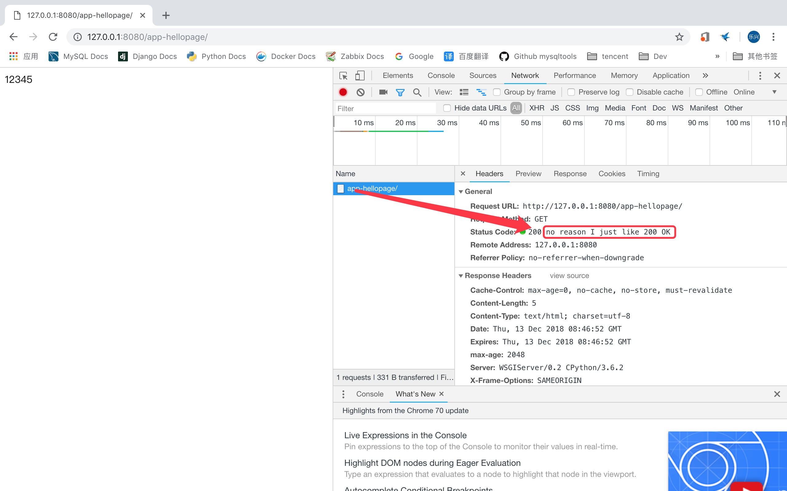

# django2docs

主编&作者:**蒋乐兴**

wechat:**jianglegege**

email:**1721900707@qq.com**

homepage:**http://www.sqlpy.com**

---

- [请求](#请求)
- [HttpRequest](#HttpRequest)
- [HttpRequest对象的属性](#HttpRequest对象的属性)
- [HttpRequest对象的函数](#HttpRequest对象的函数)
- [QueryDict](#QueryDict)
- [HttpResponse](#HttpResponse)
- [HttpResponse对象的使用方式](#HttpResponse对象的使用方式)
- [设置响应的报头](#设置响应的报头)
- [告诉浏览器把响应当成一个文件](#告诉浏览器把响应当成一个文件)
- [HttpResponse对象的属性](#HttpResponse对象的属性)

---

## 请求
   **当客户端请求一个页面的时候、Django会创建一个request对象来封装请求的元数据信息、接下来Django会加载对应的视图函数、并把request对象作为第一个参数传递给视图函数、视图函数返回一个HttpResponse对象**

   ---


## HttpRequest
   **用于封装http请求的源数据**

   ---

## HttpRequest对象的属性
   | **属性名** | **意义** |
   |-----------|-----------|
   |`HttpRequest.scheme` | http 或 https |
   |`HttpRequest.body`  | http请求体的字节序列 |
   |`HttpRequest.path`  | http请求的路径(整个url中除去ip和port之后的部分) |
   |`HttpRequest.method`  | http请求的方法(如GET、POST) |
   |`HttpRequest.encoding`| http客户端所提交数据的编码方式(如果是None那么就以DEFAULT_CHARSET配置项为准)|
   |`HttpRequest.content_type`| 请求对象的content_type报头中的内容 |
   |`HttpRequest.content_params`| 以字典形式表形的content_type的head头部分信息 |
   |`HttpRequest.GET`| 以字典形式表示的url参数|
   |`HttpRequest.POST`| 以字典形式表示的POST上传的参数(如果参数不是以表单形式传递的可能要访问HttpRequst.body对象才行)|
   |`HttpRequest.COOKIES`| 以字典形式表示的由客户端上传上来的cookie值|
   |`HttpRequest.FILES`| 以字典形式表示的由客户端上传上来的文件|
   |`HttpRequest.META` | 一个保存客户端信息的一个字典对象|
   |`HttpRequest.current_app`| 用于给应用程序自行设置的属性，模板中的url标签肝用到它|
   |`HttpRequest.urlconf`| 用于自定义请求的路由调度 |
   |`HttpRequest.session`| 一个字典对象象征着当前session |
   |`HttpRequest.site` | 象征着当前站点 |
   |`HttpRequest.user` | 象征着当前用户 |
   

   ---

## HttpRequest对象的函数
   | **函数名** | **意义** |
   |-----------|---------|
   |`HttpRequest.get_host`| 返回服务器所监听到的主机的端口(如：127.0.0.1:8080) |
   |`HttpRequest.get_port`| 返回服务器所监控的端口(如：8080)|
   |`HttpRequest.get_full_path`| 与request.path一样返回url中除去host与port之后的剩余部分|
   |`HttpRequest.build_absolute_uri`| 返回绝对url(如：http://127.0.0.1:8080/app-hellopage/?name=welson)|
   |`HttpRequest.get_signed_cookie`| 返回cookie对象|
   |`HttpRequest.is_secure`| 如果是https就返回True不然就返回False|
   |`HttpRequest.is_ajax`| 是否是ajax请求，如果是就返回True|
   |`HttpRequest.read`| 模拟文件接口|
   |`HttpRequest.readlin`| 模拟文件接口|
   |`HttpRequest.readlines`| 模拟文件接口|
   |`HttpRequest.__iter__`| 模拟文件接口|

   ---

## QueryDict
   **像request.GET、rquest.POST这些对象都是QueryDict类型的；这是一个自定义的字典类型，它主要是根据web环境进入一键多值的支持！想想checkbox吧！**

   **1):** \_\_init\_\_
   ```python
   QueryDict.__init__(query_string=None, mutable=False, encoding=None)
   ```
   例子:
   ```python
   In [1]: import django                                                                                   
   
   In [2]: django.setup()                                                                                  
   
   In [3]: from django.http import QueryDict                                                               
   
   In [4]: qd = QueryDict('a=1&a=2&c=3')                                                                   
   
   In [5]: qd                                                                                              
   Out[5]: <QueryDict: {'a': ['1', '2'], 'c': ['3']}>
   ```
   **2):** fromkeys
   ```python
   QueryDict.fromkeys(iterable, value='', mutable=False, encoding=None)
   ```
   例子：
   ```python
   In [11]: QueryDict.fromkeys(['a', 'a', 'b'], value='val')                                               
   Out[11]: <QueryDict: {'a': ['val', 'val'], 'b': ['val']}>
   ```
   **3):** \_\_getitem\_\_
   ```python
   In [17]: qd['a']                                                                                        
   Out[17]: '2'
   ```
   **4):** \_\_setitem\_\_

   默认情况下QueryDict对象是不可写的、但是QueryDict.copy() 函数返回的QueryDict对象是可以写的

   ```python
   # 默认情况下QueryDict是不可写的
   qd['a']=100

   ---------------------------------------------------------------------------
   AttributeError                            Traceback (most recent call last)
   <ipython-input-23-f957de5cdb4c> in <module>
   ----> 1 qd['a']=100
   
   /Library/Frameworks/Python.framework/Versions/3.6/lib/python3.6/site-packages/django/http/request.py in __setitem__(self, key, value)
       437 
       438     def __setitem__(self, key, value):
   --> 439         self._assert_mutable()
       440         key = bytes_to_text(key, self.encoding)
       441         value = bytes_to_text(value, self.encoding)

   In [24]: d = qd.copy()                                                                                  
   
   In [25]: d['a']=100                                                                                     
   
   In [26]: d                                                                                              
   Out[26]: <QueryDict: {'a': [100], 'c': ['3']}>

   ```
   **5):** \_\_contains\_\_
   ```python
   In [27]: 'a' in qd                                                                                      
   Out[27]: True
   ```
   **6):** get(key,defautl=None)

   如果给出的key值存在、那么就返回它的value、如果不存在就返回default中给出的值
   ```python
   In [28]: qd                                                                                             
   Out[28]: <QueryDict: {'a': ['1', '2'], 'c': ['3']}>
   
   In [29]: qd.get('a','hello world')                                                                      
   Out[29]: '2'
   
   In [30]: qd.get('f5','hello world')                                                                     
   Out[30]: 'hello world'
   ```
   **7):** update

   **更新QueryDict实例(当然如果给定的实例可以写的话)**
   ```python
   In [31]: qd.update({'a':'hello world'})                                                                 
   ---------------------------------------------------------------------------
   AttributeError                            Traceback (most recent call last)
   <ipython-input-31-cf4696e509e4> in <module>
   ----> 1 qd.update({'a':'hello world'})
   
   /Library/Frameworks/Python.framework/Versions/3.6/lib/python3.6/site-packages/django/utils/datastructures.py in update(self, *args, **kwargs)
       203                 try:
       204                     for key, value in other_dict.items():
   --> 205                         self.setlistdefault(key).append(value)
       206                 except TypeError:
       207                     raise ValueError("MultiValueDict.update() takes either a MultiValueDict or dictionary")
   ```
   更新可以写的QueryDict是可以的
   ```python
   In [32]: d = qd.copy()                                                                                  
   
   In [33]: d                                                                                              
   Out[33]: <QueryDict: {'a': ['1', '2'], 'c': ['3']}>
   
   In [34]: d.update({'a':[3,4]})                                                                          
   
   In [35]: d                                                                                              
   Out[35]: <QueryDict: {'a': ['1', '2', [3, 4]], 'c': ['3']}>
   
   In [36]: d.update({'a':'hello world'})                                                                  
   
   In [37]: d                                                                                              
   Out[37]: <QueryDict: {'a': ['1', '2', [3, 4], 'hello world'], 'c': ['3']}>
   ```
   **8):** items
   ```python
   In [40]: list(qd.items())                                                                               
   Out[40]: [('a', '2'), ('c', '3')]
   ```
   **9):** values
   ```python
   In [41]: list(qd.values())                                                                              
   Out[41]: ['2', '3']
   ```
   **11):** copy
   ```python
   In [43]: qd.copy()                                                                                      
   Out[43]: <QueryDict: {'a': ['1', '2'], 'c': ['3']}>
   ```
   **12):** getlist
   ```python
   QueryDict.getlist(key, default=None)
   ```
   ```python
   In [44]: qd.getlist('a')                                                                                
   Out[44]: ['1', '2']
   ```
   **13):** setlist
   ```python
   QueryDict.setlist(key, list_)
   ```
   ```python
   In [45]: d = qd.copy()                                                                                  
   
   In [46]: d                                                                                              
   Out[46]: <QueryDict: {'a': ['1', '2'], 'c': ['3']}>
   
   In [47]: d.setlist('a',[1,2,3])                                                                         
   
   In [48]: d                                                                                              
   Out[48]: <QueryDict: {'a': [1, 2, 3], 'c': ['3']}>
   ```
   **14):** appendlist
   ```python
   QueryDict.appendlist(key, item)
   ```
   ```python
   In [48]: d                                                                                              
   Out[48]: <QueryDict: {'a': [1, 2, 3], 'c': ['3']}>
   
   In [49]: d.appendlist('a',4)                                                                            
   
   In [50]: d                                                                                              
   Out[50]: <QueryDict: {'a': [1, 2, 3, 4], 'c': ['3']}>
   ```
   **15):** setlistdefault

   把键的值设置为了个list、前提是键的值是None或是没有这个键的情况下才会执行这项设置
   ```python
   QueryDict.setlistdefault(key, default_list=None)
   ```
   ```python
   # 键存在值、所以设置无效果
   In [52]: d                                                                                              
   Out[52]: <QueryDict: {'a': [1, 2, 3, 4], 'c': ['3']}>
   
   In [53]: d.setlistdefault('a',['hello world'])                                                          
   Out[53]: [1, 2, 3, 4]
   
   In [54]: d                                                                                              
   Out[54]: <QueryDict: {'a': [1, 2, 3, 4], 'c': ['3']}>

   # 键的值不存在才会有效果
   In [57]: d.setlistdefault('f',['hello','world'])                                                        
   Out[57]: ['hello', 'world']
   
   In [58]: d                                                                                              
   Out[58]: <QueryDict: {'a': [1, 2, 3, 4], 'c': ['3'], 'f': ['hello', 'world']}>
   ```
   **16):** pop

   返回键所对应的值并返回并删除这个键
   ```python
   In [58]: d                                                                                              
   Out[58]: <QueryDict: {'a': [1, 2, 3, 4], 'c': ['3'], 'f': ['hello', 'world']}>
   
   In [62]: d.pop('a')                                                                                     
   Out[62]: [1, 2, 3, 4]
   
   In [63]: d                                                                                              
   Out[63]: <QueryDict: {'c': ['3'], 'f': ['hello', 'world']}>
   ```
   **17):** popitem

   相比pop来说popitem的处理方式就更加“过分”了、每一调用都会pop一个k-v对、如果对空的QueryDict实例使用popitem会报`KeyError`错误
   ```python
   In [63]: d                                                                                              
   Out[63]: <QueryDict: {'c': ['3'], 'f': ['hello', 'world']}>
   
   In [64]: d.popitem()                                                                                    
   Out[64]: ('f', ['hello', 'world'])
   
   In [65]: d                                                                                              
   Out[65]: <QueryDict: {'c': ['3']}>
   
   In [66]: d.popitem()                                                                                    
   Out[66]: ('c', ['3'])
   
   In [67]: d                                                                                              
   Out[67]: <QueryDict: {}>

   In [68]: d.popitem()                                                                                    
   ---------------------------------------------------------------------------
   KeyError                                  Traceback (most recent call last)
   <ipython-input-68-83c64cff336b> in <module>
   ----> 1 d.popitem()
   
   /Library/Frameworks/Python.framework/Versions/3.6/lib/python3.6/site-packages/django/http/request.py in popitem(self)
       481     def popitem(self):
       482         self._assert_mutable()
   --> 483         return super().popitem()
       484 
       485     def clear(self):
   
   KeyError: 'popitem(): dictionary is empty'
   ```
   **17):** dict
   ```python
   In [69]: d = qd.copy()                                                                                  
   
   In [70]: d                                                                                              
   Out[70]: <QueryDict: {'a': ['1', '2'], 'c': ['3']}>
   
   In [71]: d.dict()                                                                                       
   Out[71]: {'a': '2', 'c': '3'}
   ```
   **18):** urlencode

   以url中参数的表现形式返回QueryDict中的内容
   ```python
   In [71]: d.dict()                                                                                       
   Out[71]: {'a': '2', 'c': '3'}
   
   In [72]: d.urlencode()                                                                                  
   Out[72]: 'a=1&a=2&c=3'
   ```

   ---

## HttpResponse
   **HttpResponse是一个view的返回值、它代表着返回给浏览器的内容**

   ---

## HttpResponse对象的使用方式

   **1):传递字符串**
   ```python
   def hellopage(request):
       """
       """
       resp  = HttpResponse("<!doctype html><html><head><title>passing string</title></head><body><p>Hello world</p></body></html>")
       return resp
   ```
   

   **2):把response当做一个文件对象来用** 
   ```python
   def hellopage(request):
       """
       """
       head = "<!doctype html><html><head><title>passing string</title></head><body>"
       content = "<body><p>use response as a file-like object</p>"
       end = "</body></html>"
       resp = HttpResponse()
       resp.write(head)
       resp.write(content)
       resp.write(end)
       return resp
   ```
   

   **3):传递可以迭代对象给HttpResponse实例**

   不只是可以传递str给HttpResponse实例、任何的可迭代对象都可以；如果传递给HttpResponse实例的对象实现了close方法，HttpResponse实例会去保证调用这个方法
   ```python
   def hellopage(request):
       """
       """
       list_ = [1,2,3,4,5]
       return HttpResponse(list_)
   ```

   ---

## 设置响应的报头
   可以把HttpResponse实例当成字典来用、这样可以为响应设置报头
   ```python
   def hellopage(request):
       """
       """
       list_ = [1,2,3,4,5]
       resp =  HttpResponse(list_)
       resp['max-age'] = '2048'
       return resp
   ```
   

   可以看到response中有两个max-age并且我们自己设置的那个max-age的位置是不对的；官方希望我们在指定cache相关的报头的时候用相应的装饰器完成

   ---

## 告诉浏览器把响应当成一个文件
   ```python
   response = HttpResponse(my_data, content_type='application/vnd.ms-excel')
   response['Content-Disposition'] = 'attachment; filename="foo.xls"'
   ```

   ---

## HttpResponse对象的属性
   **1): HttpResponse.content** 以字节对象表示的响应内容

   **2): HttpResponse.charset** 响应的字符集

   **3): HttpResponse.status_code** 响应码

   **4): HttpResponse.reason_phrase** 指的是对状态码的解决、比如说为什么返回200 ok !
   ```python
   def hellopage(request):
       """
       """
       list_ = [1,2,3,4,5]
       resp =  HttpResponse(list_)
       resp['max-age'] = '2048'
       resp.reason_phrase='no reason I just like 200 OK'
       return resp
   ```
   

   **5): HttpResponse.streaming** 标识返回的数据是不是一个“数据流”、django的中间件会根据这个值对返回的Response做不同的处理

   **6): HttpResponse.closed** 如果说`True`说明响应对象被正常关闭

   --- 

## HttpResponse对象的方法
   **1): HttpResponse.\_\_init\_\_** 初始化一个HttpResponse对象
   ```python
   HttpResponse.__init__(content='', content_type=None, status=200, reason=None, charset=None)
   ```
   **2): HttpResponse.\_\_setitem\_\_** 通过\[\]写法来设置响应的报头
   ```python
   HttpResponse.__setitem__(header, value)
   ```
   **3): HttpResponse.\_\_delitem\_\_** 同上只不过用处是删除指定的报头
   ```python
   HttpResponse.__delitem__(header)
   ```
   **4): HttpResponse.\_\_getitem\_\_** 查询给定的报头键所对应的值
   ```python
   HttpResponse.__getitem__(header)
   ```
   **5): HttpResponse.has_header** 查询响应对象中是否有对应的报头
   ```python
   HttpResponse.has_header(header)
   ```
   **6): HttpResponse.setdefault** 如果响应对象还没有设置报头的值、那么就给它设置一个
   ```python
   HttpResponse.setdefault(header, value)
   ```
   逻辑上等同于
   ```python
   def hellopage(request):
       """
       """
       list_ = [1,2,3,4,5]
       resp =  HttpResponse(list_)
       # resp.setdefault('default-key','hello world x!') 与下面的if语句等价
       if not resp.has_header('default-key'):
           resp['default-key'] = 'hello world x!'
       return resp
   ```
   **7): HttpResponse.set_cookie** 设置cookie值
   ```python
   HttpResponse.set_cookie(key, value='', max_age=None, expires=None, 
                           path='/', domain=None, secure=None, httponly=False, samesite=None)
   ```
   不设置cookie时的报文内容
   

   给响应加的cookie加个一个nickname=Welson
   ```python
   def hellopage(request):
       """
       """
       list_ = [1,2,3,4,5]
       resp =  HttpResponse(list_)
       resp.set_cookie(key='nickname',value='Welson')
       return resp
   ```
   

   **8): HttpResponse.delete_cooki** 删除cookie中给定的键值
   ```python
   HttpResponse.delete_cookie(key, path='/', domain=None)
   ```

   **9): HttpResponse.write** 以文件形式使用响应对象
   ```python
   HttpResponse.write(content)
   ```
   **10): HttpResponse.flush** 以文件形式使用响应对象
   ```python
   HttpResponse.flush()
   ```
   **11): HttpResponse.tell** 以文件形式使用响应对象
   ```python
   HttpResponse.tell()
   ```
   **12): HttpResponse.getvalue** 返回HttpResponse.content
   ```python
   HttpResponse.getvalue()
   ```
   **13): HttpResponse.readable** 永远返回False
   ```python
   HttpResponse.readable()
   ```
   **14): HttpResponse.seekable** 永远返回False
   ```python
   HttpResponse.seekable()
   ```
   **15): HttpResponse.writable** 永远返回True
   ```python
   HttpResponse.writable()
   ```
   **16): HttpResponse.writelines** 以文件形式使用响应对象
   ```python
   HttpResponse.writelines(lines)
   ```

   ---
