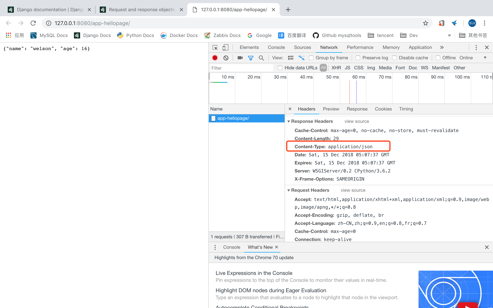
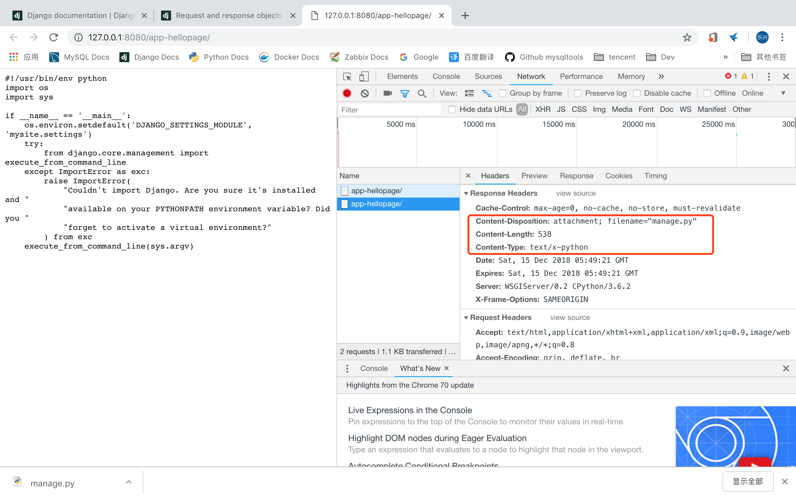

# django2docs

主编&作者:**蒋乐兴**

wechat:**jianglegege**

email:**1721900707@qq.com**

homepage:**http://www.sqlpy.com**

---

- [简介](#简介)
- [HttpResponseRedirect](#HttpResponseRedirect)
- [JsonResponse](#JsonResponse)
- [StreamingHttpResponse](#StreamingHttpResponse)
- [FileResponse](#FileResponse)
- [其它响应类型](#其它响应类型)

---

## 简介
   **django为常见的响应从HttpResponse中专门派生了对应的子类**


## HttpResponseRedirect
   **用于做请求的从定向**
   ```python
   def hellopage(request):
       """
       """
       return HttpResponseRedirect("https://www.baidu.com") # 只有一个参数那就是要从定义到的目标地址！
   ```
   ---

## JsonResponse
   **HttpResponse的子类、用于创建json格式的响应**
   ```python
   JsonResponse(data, encoder=DjangoJSONEncoder, safe=True, json_dumps_params=None, **kwargs)
   ```
   **1):** 相比HttpResponse来说JsonResponse返回对象的`Content-Type`类型为`application/json`

   **2):** data参数最好是一个字典对象，如果safe参数设置为False那么data可以是任何可以序列化的对象

   **3):** json_dumps_params 是一个字典，这个字典的值会被传递到`json.dumps()`函数中去

   ```python
   def hellopage(request):
       """
       """
       person = {'name':'welson','age':16}
       return JsonResponse(data=person)
   
   ```
   

   ---

## StreamingHttpResponse
   **StreamingHttpResponse 用于将响应以“流”的形式发往客户端、比如向客户端发一个csv文件这样的场景；注意django更加适合的是处理那些短的在线请求，而不是动不动返回个大对象的场景**

   |**属性名**|**意思**|
   |---------|-------|
   |`StreamingHttpResponse.streaming_content`| 流的内容 |
   |`StreamingHttpResponse.status_code`      | 状态码   |
   |`StreamingHttpResponse.reason_phrase`    | 对状态码的解释性信息|
   |`StreamingHttpResponse.streaming`        | 永远是`True`      |

   ---

## FileResponse
   **是StreamingHttpResponse的一个子类、专门针对文件返回做了优化；大致上就把文件分成一个个小的chunk、这样就不要一次性把内容载入内存。**
   ```python
   FileResponse(open_file, as_attachment=False, filename='', **kwargs)
   ```
   **1):** 如果`as_attachment`参数设置为True那么django就会设置响应的`Content-Disposition`报头，当浏览器看到`Content-Disposition`这个MIME扩展的时候就会启动文件下载了

   **2):** 不用当心文件不会自动关闭，官方文档中这样写到`The file will be closed automatically, so don’t open it with a context manager.`

   **3):** 打开文件的时候请用2进制的形式打开不要用文件形式打开

   ```python
   from mysite.settings import BASE_DIR
   # Create your views here.
   
   @never_cache
   def hellopage(request):
       """
       """
       file_abs_path = os.path.join(BASE_DIR,'manage.py')
       return FileResponse(open(file_abs_path, 'rb'),as_attachment=True) #不设置as_attachment=True不会触发下载动作。
   ```
   

   ---

## 其它响应类型
   |**响应类型**    | **子类名** |**响应码**|
   |--------------|-----------|----------|
   |永久重定向      | `HttpResponsePermanentRedirect` | 302  |
   |请求的资源并没有改变过|` HttpResponseNotModified`   | 304  |
   |站点认为请求有问题|`HttpResponseBadRequest`        | 400  |
   |对应的资源不存在|`HttpResponseNotFound`            | 404  |
   |禁止访问      |`HttpResponseForbidden`            | 403 |
   |请求的方法不对所以不允许访问      |`HttpResponseNotAllowed`           | 405  |
   |资源已经失效   |`HttpResponseGon`                  | 410  |
   |服务器内部错误  |`HttpResponseServerError`         | 500 |
   ---

