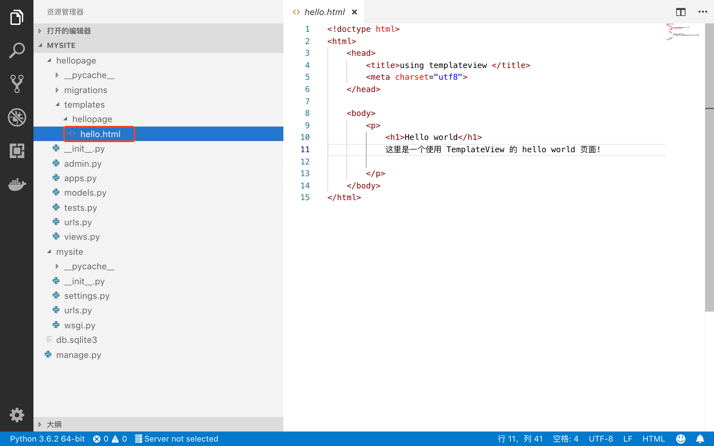
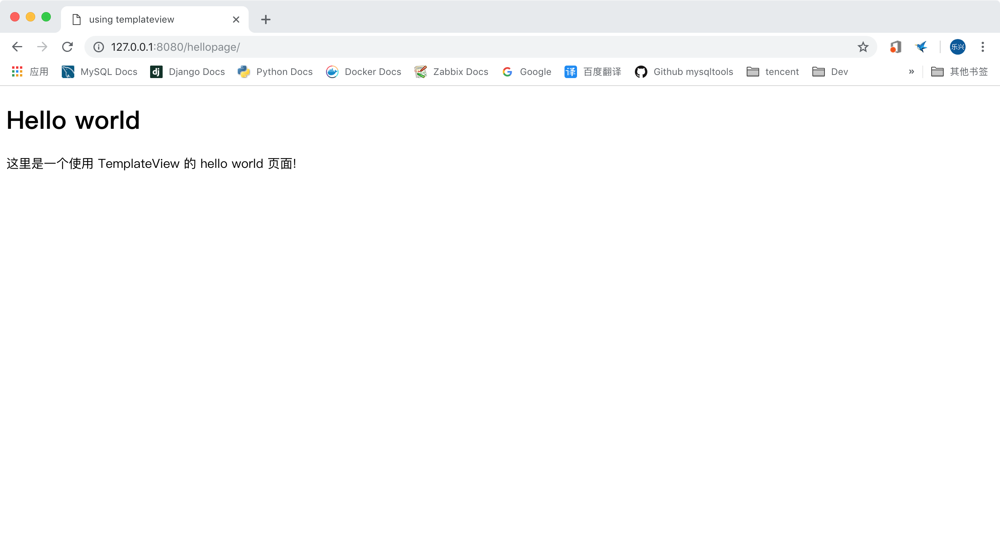

# django2docs

主编&作者:**蒋乐兴**

wechat:**jianglegege**

email:**1721900707@qq.com**

homepage:**http://www.sqlpy.com**

---

- [简介](#简介)
- [View的基本功能](#View的基本功能)
- [在urlconf中使用View](#在urlconf中使用View)
- [自定义View的子类](#自定义View的子类)
- [ClassBasedViews对http请求方法的支持](#ClassBasedViews对http请求方法的支持)

---

## 简介
   **都到这里了，是时候“回顾”一下“视图函数”的本质了？那么“视图函数”的本质又是什么呢？ 视图函数是接受一个request请求对象、返回一个HttpResponse对象的可调用对象！**

   **我们完全可以让类也有具有上面的“特点”，使用类的好处在于代码层次性、可复用性上都优于函数！对于这种专门接受一个request请求对象、返回一个HttpResponse对象的类就叫它View！**

   ---

## View的基本功能
   **1):** 维护url到对应的处理函数的连接关系、并可以根据不同的http请求方式连接到不同的处理函数

   **2):** RedirectView 就是专门用来做重定向的

   **3):** TemplateView 扩展自View专门用来做模板的渲染

   ---

## 在urlconf中使用View
   **View是所有基于类的视图的父类、对于最常见的渲染模板操作djagno专门给它定义了子类`TemplateView`，下面以TemplateView为例看在urlconf中如果使用**

   **1):** 整个项目看起来还是和之前一样 还是用hello.html作为一个模板
   

   **2):** 调用类方法`as_view`并传我们刚才的模板
   ```python
   from django.urls import path
   from hellopage.views import hellopage
   from django.views.generic.base import TemplateView
   
   
   urlpatterns = [
       #path('',hellopage), #注意之前这里是指定一个函数，在使用View的时候是对类方法`as_view的一次调用`
       path('',TemplateView.as_view(template_name='hellopage/hello.html'))
   ]
   ```
   项目的rooturlconf如下：没有变过
   ```python
   urlpatterns = [
       path('admin/', admin.site.urls),
       path('hellopage/',include('hellopage.urls')),
   ]
   ```

   这样整个功能就完成了、也就是说我们只动了urlconf中的一行代码
   

   ---

## 自定义View的子类
   **上面的例子“在urlconf中使用View”是对View最粗浅的用法，View真正的强大是与python的继承与混入机制的结合**

   **1): 定义一个基于View的视图**
   ```python
   class MainPageView(TemplateView):
       template_name="hellopage/hello.html"
   ```
   **2): 注册url到处理函数的映射**
   ```python
   urlpatterns = [
       path('',MainPageView.as_view()) # 这里不再需要参数了、因为我们在定义MainPageView的时候已经写入了
   ]
   ```

   ---

## ClassBasedViews对http请求方法的支持
   **在之前的视图函数中我们可以通过在代码中对`request.method`属性进行判断、从而为get、post、head ... 应用不同的处理方式。在class-based-views中不用这么累了，View中定义的dispather方法为我们们完成这些事**
   ```python
   #由类的定义可以看出View和HttpResponse没有半毛钱的直接关系
   class View:
       #列表中定义了View所支持的请求方式
       http_method_names = ['get', 'post', 'put', 'patch', 'delete', 'head', 'options', 'trace']
       #这个方法定义了当View了或它的子类要处理一个不支持的方式时会怎样
       def http_method_not_allowed(self, request, *args, **kwargs):
           logger.warning(
               'Method Not Allowed (%s): %s', request.method, request.path,
               extra={'status_code': 405, 'request': request}
           )
           return HttpResponseNotAllowed(self._allowed_methods())
       #这个方法里定义View是怎么调度的
       def dispatch(self, request, *args, **kwargs):
           if request.method.lower() in self.http_method_names:
               #最关键的一行在这里、说明View会根据不同的http请求方法、调用不同的处理函数(方法)
               handler = getattr(self, request.method.lower(), self.http_method_not_allowed)
           else:
               handler = self.http_method_not_allowed
           return handler(request, *args, **kwargs)
   ```
   **以官方的RedirectView为例**
   ```python
   class RedirectView(View):
       """Provide a redirect on any GET request."""
       permanent = False
       url = None
       pattern_name = None
       query_string = False
   
       def get_redirect_url(self, *args, **kwargs):
           if self.url:
               url = self.url % kwargs
           elif self.pattern_name:
               url = reverse(self.pattern_name, args=args, kwargs=kwargs)
           else:
               return None
   
           args = self.request.META.get('QUERY_STRING', '')
           if args and self.query_string:
               url = "%s?%s" % (url, args)
           return url
       #处理http get方式发起的请求
       def get(self, request, *args, **kwargs):
           url = self.get_redirect_url(*args, **kwargs)
           if url:
               if self.permanent:
                   return HttpResponsePermanentRedirect(url)
               else:
                   return HttpResponseRedirect(url)
           else:
               logger.warning(
                   'Gone: %s', request.path,
                   extra={'status_code': 410, 'request': request}
               )
               return HttpResponseGone()
       #处理http head方式发起的请求
       def head(self, request, *args, **kwargs):
           return self.get(request, *args, **kwargs)
       #处理http post方式发起的请求
       def post(self, request, *args, **kwargs):
           return self.get(request, *args, **kwargs)
   ```
   也就是说View已经把不同的http请求方式对应到了View的一个个方法中、如果我们要支持GET请求、那么我们定义一个get方法。

   ---

