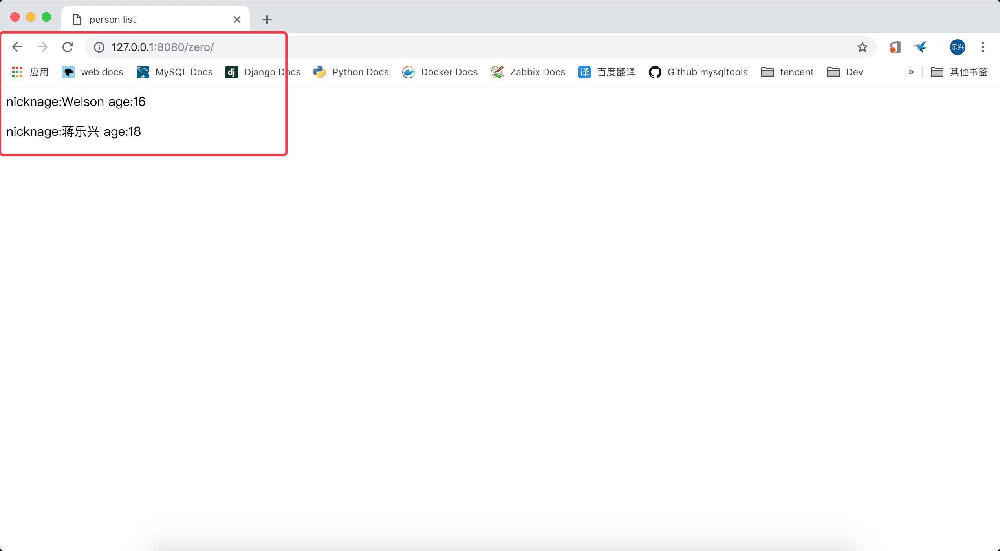
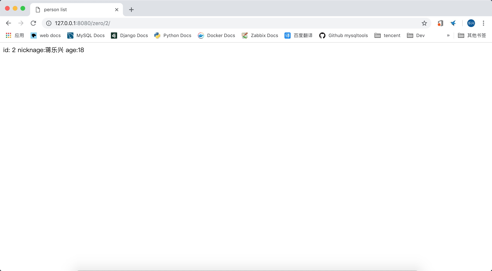
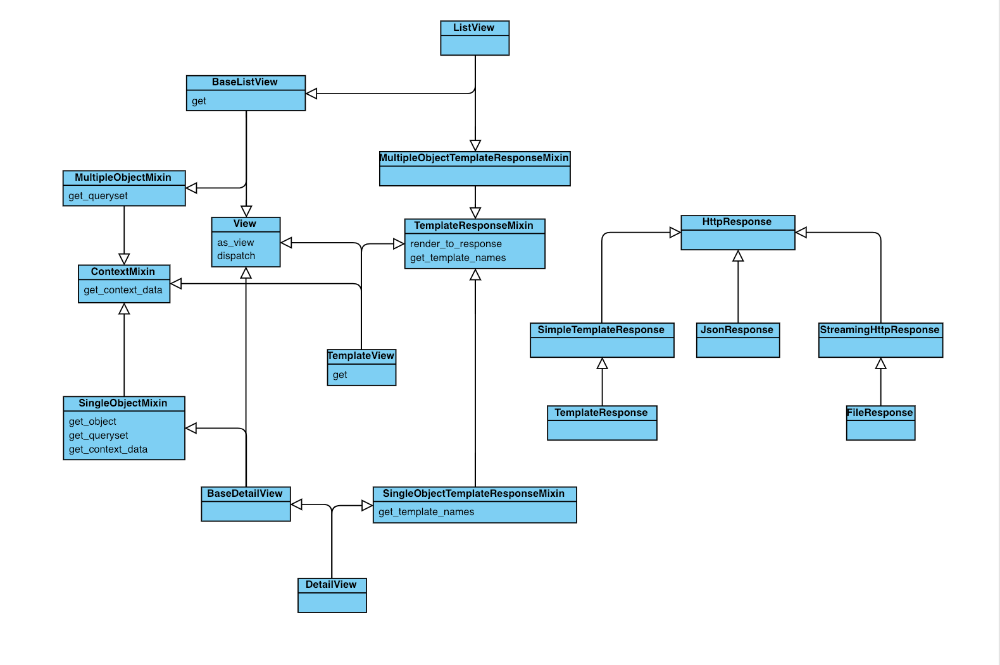

# django2docs

主编&作者:**蒋乐兴**

wechat:**jianglegege**

email:**1721900707@qq.com**

homepage:**http://www.sqlpy.com**

---

- [简介](#简介)
- [一个用generic-view显示内容的例子](#一个用generic-view显示内容的例子)
- [动态过虑特殊对象](#动态过虑特殊对象)
- [额外操作](#额外操作)
- [各个类之间的继承关系](#各个类之间的继承关系)

---


## 简介
   **在Web开发中我们发现有许多的地方都是重复的、比如说我们不段的处理着对象的展示、集合的展示、归档、增删改查 ... 等等 django把这些通用的功能抽象到了各个不同的类中实现，这样就有了通用视图**

   ---

## 一个用generic-view显示内容的例子
   **1): 假设我们有一个Person表用来保存一些大人物的个人信息、表的设计如下(我为之专门创建了一个app叫zero)**
   ```python
   class Person(models.Model):
       nickname = models.CharField(max_length=8)
       age = models.PositiveSmallIntegerField()
       last_accesstime = models.DateTimeField()
   ```
   表中的数据如下：
   ```sql
   select * from zero_person;
   +----+-----------+-----+----------------------------+
   | id | nickname  | age | last_accesstime            |
   +----+-----------+-----+----------------------------+
   |  1 | Welson    |  16 | 2018-12-22 15:18:26.000000 |
   |  2 | 蒋乐兴    |  18 | 2018-12-22 15:18:55.000000 |
   +----+-----------+-----+----------------------------+
   2 rows in set (0.00 sec)
   ```
   **2): 增加一个用于展示所有人物信息的视图**
   ```python
   from django.views.generic.list import ListView
   
   from zero.models import Person
   # Create your views here.
   
   #没有看错！ 用通用视图写起来就两行代码！
   class PersonListView(ListView):
       model = Person
   
   ```
   **3): 增加一个html模板文件zero/person_list.html**
   ```html
   <html>
       <head>
           <title>person list</title>
           <meta charset="utf8">
       </head>
   
       <body>
           
           <p>nicknage:{{person.nickname}} age:{{person.age}}</p>
           
       </body>
   </html>
   ```
   **4): 大浏览器中查看**
   

   >可以发现我们在PersonListView类中并有指定html模板文件名，但是django它确正确的找到了，这个主要是因为django对于ListView会去找modelname_list.html文件

   ---

## 动态过虑特殊对象
   **上面的例子会把所有的person对象都展示出来，项目上来说最常见的是展示特定对象，要给ListView子类加上动态过滤也是非常简单的事**

   **1): 让url可以接收到参数** 
   ```python
   from django.urls import path,include
   from zero.views import PersonListView
   
   urlpatterns = [
       path('<int:pk>/', PersonListView.as_view()),
   ]
   ```
   **2) 重写get_queryset方法**
   ```python
   class PersonListView(ListView):
       #不再使用model、传而重载get_queryset方法
       #model = Person
   
       def get_queryset(self):
           objs = Person.objects.all().filter(pk=self.kwargs.get('pk'))
           return objs
   ```
   **3): 为了对我们更加友好让html中显示id值**
   ```html
   <html>
       <head>
           <title>person list</title>
           <meta charset="utf8">
       </head>
   
       <body>
           
           <p>id: {{person.id}} nicknage:{{person.nickname}} age:{{person.age}}</p>
           
       </body>
   </html>
   ```
   **4): 在浏览器中查看**
   

   ---

## 额外操作
   **上面的例子中我们只是单纯的查询了数据库中的对象、如果我想记录一下某个对象的最近一次的访问怎么办呢？说来了是简单就是在访问对象的时候把访问时间更新回数据库就行了**
   ```python
   class PersonListView(ListView):
       #不再使用model、传而重载get_queryset方法
       #model = Person
   
       def get_queryset(self):
           objs = Person.objects.all().filter(pk=self.kwargs.get('pk'))
           #由于objs是一个queryset所以针对它的更新会自动save到数据库，不用像更新单个对象一样要调用save方法
           objs.update(last_accesstime=now())
           return objs
   ```
   比较访问前后记录中的时间
   ```sql
   mysql> select * from zero_person;
   +----+-----------+-----+----------------------------+
   | id | nickname  | age | last_accesstime            |
   +----+-----------+-----+----------------------------+
   |  1 | Welson    |  16 | 2018-12-22 15:18:26.000000 |
   |  2 | 蒋乐兴    |  18 | 2018-12-22 15:18:55.000000 |
   +----+-----------+-----+----------------------------+
   2 rows in set (0.00 sec)
   
   mysql> select * from zero_person;
   +----+-----------+-----+----------------------------+
   | id | nickname  | age | last_accesstime            |
   +----+-----------+-----+----------------------------+
   |  1 | Welson    |  16 | 2018-12-22 15:18:26.000000 |
   |  2 | 蒋乐兴    |  18 | 2018-12-22 07:53:06.081240 |
   +----+-----------+-----+----------------------------+
   2 rows in set (0.00 sec)
   ```
   >可以发现id=2行对应的last_accesstime已经变了

   ---

## 各个类之间的继承关系
   
   


