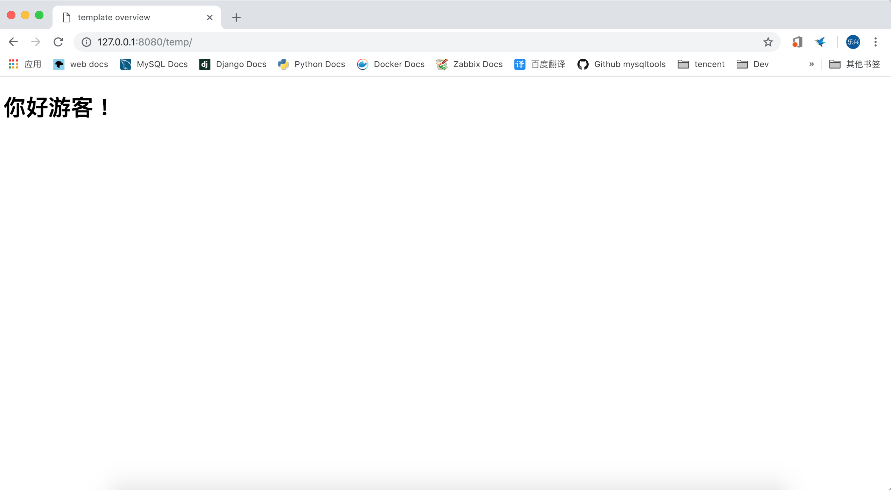
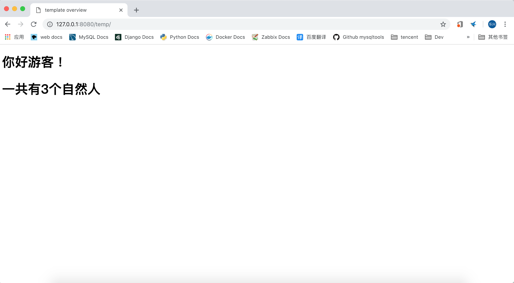
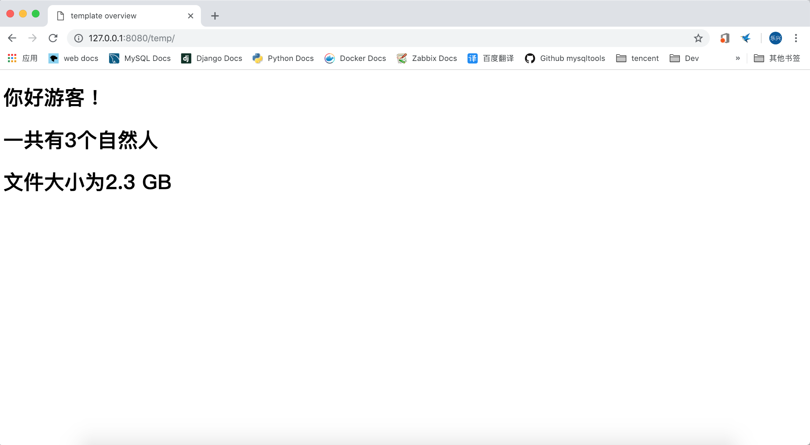

# django2docs

主编&作者:**蒋乐兴**

wechat:**jianglegege**

email:**1721900707@qq.com**

homepage:**http://www.sqlpy.com**

---

- [简介](#简介)
- [模板是什么](#模板是什么)
- [模板变量](#模板变量)
- [模板过滤器](#模板过滤器)
- [模板标记](#模板标记)
- [模板注释](#模板注释)
- [模板继承](#模板继承)
- [自动html转意](#自动html转意)

---

## 简介
   **django模板语言在设计之初就面临权衡取舍，是要功能强大无所不能，还是要易于使用降低学习成本，最终djagno选择了后者**

   ---

## 模板是什么
   **模板就是一个简单的文本文件，它可以用于生成任何格式的文本文件(csv,xml,html ...)**

   一个模板文件的例子
   ```html
   
   
   {{ section.title }}
   
   
   <h1>{{ section.title }}</h1>
   
   
   <h2>
     <a href="{{ story.get_absolute_url }}">
       {{ story.headline|upper }}
     </a>
   </h2>
   <p>{{ story.tease|truncatewords:"100" }}</p>
   
   
   ```
   随着模板的引入它也带来了一些概念`变量`,`过滤器`,`标记`,`注释`,`继承` ... 

   ---

## 模板变量
   **变量在这个语境下有两层涵意 1):一个占位符 2):模板在渲染时会把变量的值增写回占位符；在模板中变量的表现形式如下**
   ```html
   {{ variable }}
   ```
   如果给出的变理名在上下文中不存在、那么渲染引擎会用`string_if_invalid`这个配置项所对应的值进行代替

   ---

## 模板过滤器
   **过滤器用于在模板被渲染之前对变量做进一步的处理，比如把变量的内容全都变成小写，首字母大写，...**
   ```html
   {{ name|lower }}
   {{ text|escape|linebreaks }} <!-- 也就是说过滤器的输出可以作为另一个过滤器的输入 -->
   {{ list|join:", " }} <!-- 过滤器还可以有自己的参数 -->
   ```
   **3个常见的过滤器**

   1、`default` 当给定变量的值并不存在时用default中指定的值来代替
   >tempapp/base.html 当上下文中没有给定name的时候就用'游客'来替代
   ```html
   <!DOCTYPE html>
   <html>
       <head>
           <title>template overview</title>
       </head>
   
       <body>
           <h1>你好{{ name | default:"游客"}} !</h1>
   
       </body>
   </html>
   ```
   ```python
   def index(request):
       tplt = loader.get_template('tempapp/base.html')
       html = tplt.render(context={}) #可以看到上下文空的、也就是说引擎在渲染模板的时候是找不到name这个变量的
       return HttpResponse(html)
   ```
   

   2、返回一个值的长度`length`
   >渲染时计算persons变量的长度
   ```html
   <!DOCTYPE html>
   <html>
       <head>
           <title>template overview</title>
       </head>
   
       <body>
           <h1>你好{{ name | default:"游客"}} !</h1>
           <h1>一共有{{persons | length}}个自然人</h1>
   
       </body>
   </html>
   ```
   ```python
   def index(request):
       tplt = loader.get_template('tempapp/base.html')
       html = tplt.render(context={'persons':['tom','jerry','piter']})
       return HttpResponse(html)
   ```
   

   3、以人类友好的形式显示文件大小`filesizeformat`
   ```html
   <!DOCTYPE html>
   <html>
       <head>
           <title>template overview</title>
       </head>
   
       <body>
           <h1>你好{{ name | default:"游客"}} !</h1>
           <h1>一共有{{persons | length}}个自然人</h1>
           <h1>文件大小为{{ fsize | filesizeformat }}</h1>
   
       </body>
   </html>
   ```
   ```python
   def index(request):
       tplt = loader.get_template('tempapp/base.html')
       html = tplt.render(context={'persons':['tom','jerry','piter'],'fsize':1024*1024*1024*2.34})
       return HttpResponse(html)
   ```
   

   ---

## 模板标记
   **标记相对与变量来说就复杂多了，它的主要功能如下1):流程控制 2):加载外部信息；标签的一般形式如下**
   ```html
    ... tag contents ... 
   ```
   ---

## 模板注释
   **注释的内容不会渲染到输出、注释的一般形式如下**
   ```html
   {# ...注释... #}
   ```

   ---

## 模板继承
   **模板继承应该算是django模板中最值一提的特性了，它把面向对象编程的思想引入到了模板的编写中，大大的方便了页面的定义**
   >在基础模板中完成骨架的定义、作为这一思想的实际运用应该只把“内容”包在`block`中不要把html标签也包进去
   ```html
   <!DOCTYPE html>
   <html lang="en">
   <head>
       <link rel="stylesheet" href="style.css">
       <title>My amazing site</title>
   </head>
   
   <body>
       <div id="sidebar">
           
           <ul>
               <li><a href="/">Home</a></li>
               <li><a href="/blog/">Blog</a></li>
           </ul>
           
       </div>
   
       <div id="content">
           
       </div>
   </body>
   </html>
   ```
   在子模板(继承了父模板)中就可以重写父模板中定义的内容了
   ```html
   
   
   My amazing blog
   
   
   
       <h2>{{ entry.title }}</h2>
       <p>{{ entry.body }}</p>
   
   
   ```
   **1): extends** 表明这个模板是继承自另一个模板
   
   ---

## 自动html转意
   **默认情况下在渲染模板对象的时候会把{{ var_name }}的内容进行转意，转意提高了安全性。**

   **方法一：safe过滤器**
   ```html
   This will not be escaped: {{ data|safe }}
   ```

   **方法二：使用autoescape块**
   ```
   
    Hello {{ name }}
   
   ```

   **注意在defaults中定义的常量不会转意**
   ```html
   # 这事写法是错误的、"<" 会引起问题
   {{ data|default:"3 < 2" }}
   ```
   应该要这样
   ```html
   {{ data|default:"3 &lt; 2" }}
   ```

   ---

