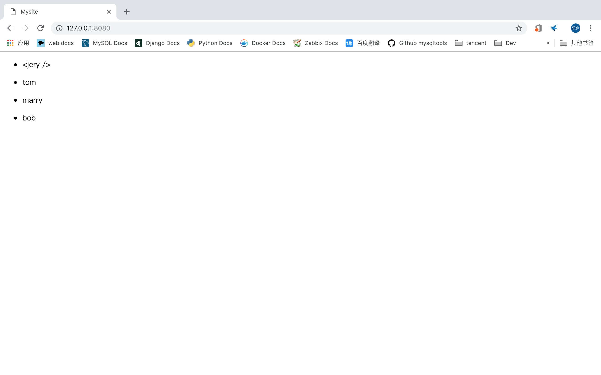
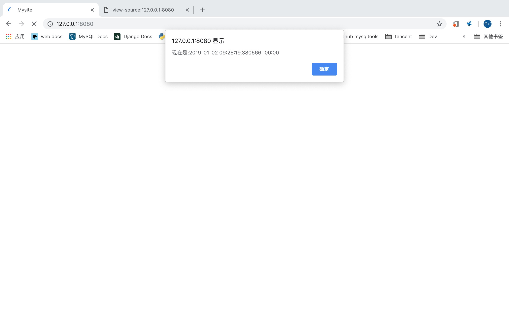
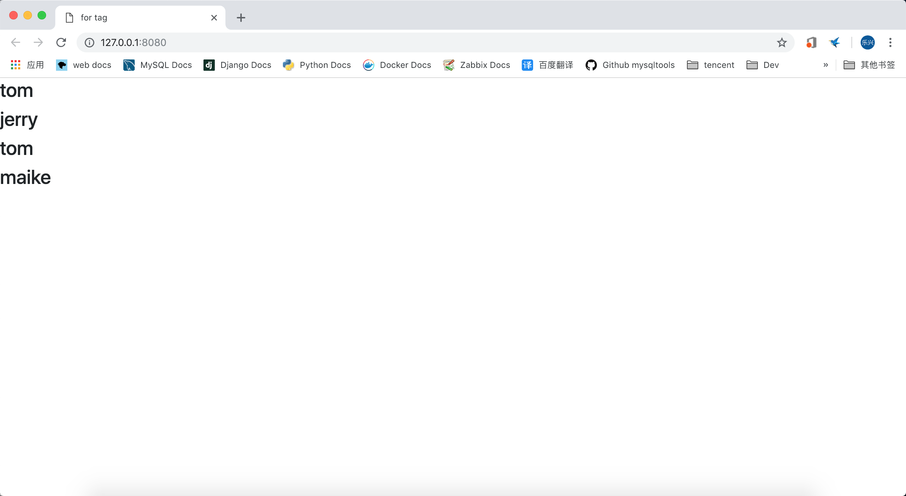

# django2docs

主编&作者:**蒋乐兴**

wechat:**jianglegege**

email:**1721900707@qq.com**

homepage:**http://www.sqlpy.com**

---

- [autoescape](#autoescape)
- [block](#block)
- [csrf_token](#csrf_token)
- [cycle](#cycle)
- [extends](#extends)
- [filter](#filter)
- [firstof](#firstof)
---


## autoescape
   **控制当前的自动行为,autoescape接收off | on 两个参数、以此来决定是否在对应的块中应用转意行为;通常情况下自动转意才是我们真正需要的**
   
   **1):** 看一组正常数据的渲染(模板+python)
   ```html
   <ul>
       
           <li><p>{{ name }}</p></li>
       
   </ul>
   ```
   ```python
   def index_page(request):
       tplt = loader.get_template('shared/index.html')
       names = ['jery','tom','marry','bob']
       html = tplt.render({'names':names},request)
       return HttpResponse(html)
   ```
   渲染完成后的html代码
   ```html
   <ul>
           <li><p>jery</p></li>
           <li><p>tom</p></li>
           <li><p>marry</p></li>
           <li><p>bob</p></li>
   </ul>
   ```
   >完美！如果我们的数据中就包涵有`< >`这种类型的字符呢?

   **2):** 看一组有异常数据的情况
   ```python
   def index_page(request):
       tplt = loader.get_template('shared/index.html')
       names = ['<jery />','tom','marry','bob']
       html = tplt.render({'names':names},request)
       return HttpResponse(html)
   ```
   渲染完成后的效果如下
   ```html
   <ul>           
           <li><p>&lt;jery /&gt;</p></li> <!-- 可以看到django自己帮我们做了"<"的转意操作 -->
           <li><p>tom</p></li>
           <li><p>marry</p></li>
           <li><p>bob</p></li>
   </ul>
   ```
   

   **然而个别时候自动转意并不是我们真正想要的，比如说我们的网页中有动态js的内容(完成一个报时功能----当用户进入页面的时候告诉他现在的时间)**
   
   怎么做到的呢？
   ```python
   def index_page(request):
       tplt = loader.get_template('shared/index.html')
   
       names = ['<jery />','tom','marry','bob']
       js = "<script>alert( '现在是:' + '{0}' );</script>".format(timezone.now())
   
       html = tplt.render({'names':names,'js':js},request)
       return HttpResponse(html)
   ```
   模板文件也要改一下:
   ```html
   <!DOCTYPE html>
   <html>
       <head>
           <title>
               Mysite
           </title>
       </head>
       <body>
           <ul>
               
                   <li><p>{{ name }}</p></li>
               
           </ul>
       </body>
       <!-- 加一个safe过虑器、这就是告诉django这个是安全的不用转意 -->
       {{ js | safe }}
   </html>
   ```
   渲染后的代码如下
   ```html
   <!DOCTYPE html>
   <html>
       <head>
           <title>
               Mysite
           </title>
       </head>
       <body>
           <ul>
                   <li><p>&lt;jery /&gt;</p></li>
                   <li><p>tom</p></li>
                   <li><p>marry</p></li>
                   <li><p>bob</p></li>
           </ul>
       </body>
       <script>alert( '现在是:' + '2019-01-02 09:27:33.605838+00:00' );</script>
   </html>
   ```
   终于到重点了，autoescape就是为了方便，因为在`autoescape off`的所有变量都不会转意
   ```html
   <!DOCTYPE html>
   <html>
       <head>
           <title>
               Mysite
           </title>
       </head>
       <body>
           <ul>
               
                   <li><p>{{ name }}</p></li>
               
           </ul>
       </body>
       
       {{ js }}
       <!-- autoescape off -->
       
   </html>
   ```
   ---

## block
   **定义一个块、子模板中可以对这个块进行重写**
   
   ---

## comment
   **注释**
   ```
   
       <p>Commented out text with {{ create_date|date:"c" }}</p>
   
   ```
   ---

## csrf_token
   **用于csrf防御**

   ---

## cycle
   **循环取值、特别适合用在列表项有白暗相间条纹的那种**
   ```python
   def index_page(request):
       tplt = loader.get_template('shared/index.html')
       names = ['jery','tom','marry','bob']
       html = tplt.render({'names':names},request)
       return HttpResponse(html) 
   ```
   模板中内容如下：
   ```html
   <!DOCTYPE html>
   <html>
       <head>
           <title>
               Mysite
           </title>
       </head>
   
       <body>
           <ul>
               
                   <li><p class="">{{ name }}</p></li>
                   {# 这样的话cycle就可以循环的为list中的项分配`row1`,`row2`这两个值了 #}
               
   
           </ul>
   
       </body>
   
   
   </html>
   ```
   渲染后的内容如下：
   ```html
   <!DOCTYPE html>
   <html>
       <head>
           <title>
               Mysite
           </title>
       </head>
   
       <body>
           <ul>
               
                   <li><p class="row1">jery</p></li>
               
                   <li><p class="row2">tom</p></li>
               
                   <li><p class="row1">marry</p></li>
               
                   <li><p class="row2">bob</p></li>
               
   
           </ul>
   
       </body>
   
   
   </html>
   ```

   ---

## extends
   **用于指定子模板是继承自哪个父模板的**
   ```html
    <!-- 父模板可以直接用字符串表示 -->
       <!-- 也可以是一个变量 -->
   ```
   >虽然父模板可以使用相对路径来指定、不过实践中是好还是用绝对的好一点

   ---

## filter
   **文件的应用多个过滤器**

   比如：想把一段话自动转意并且小写，我们可以这样做(也就是说可以把多个过滤器串联在一起)
   ```html
   {{ "This text will be HTML-escaped, and will appear in all lowercase.<... >" | force_escape | lower}}
   ```

   filter是这个写法一个简单方式(可以减少重复劳动)
   ```html
   
        This text will be HTML-escaped, and will appear in all lowercase.<... >
   
   ```
   **注意写种写法对字符串的处理方式、{{}}本质上还是python思想， 已经是html思维了**
   ```html
   <!DOCTYPE html>
   <html>
       <head>
           <title>
               Mysite
           </title>
       </head>
       <body>
        {{ "This text will be HTML-escaped, and will appear in all lowercase.<... >" | force_escape | lower}}
        <br/> <!-- 这两段打印代码的效果是一样的 -->
        
        This text will be HTML-escaped, and will appear in all lowercase.<... >
        
       </body>
   </html>
   ```
   ---

## firstof
   **打印第一个if测试为正的值、逻辑上等于**
   ```html
   


   
       {{ var1 }}
   
       {{ var2 }}
   
       {{ var3 }}
   
   ```
   ```python
   def index_page(request):
       tplt = loader.get_template('shared/index.html')
       html = tplt.render({'None':None,'empty_list':[],'empty_set':{},'empty_str':''},request)
       return HttpResponse(html)
   ```
   ```html
   <!DOCTYPE html>
   <html>
       <head>
           <title>
               Mysite
           </title>
       </head>
       <body>
            <!-- 显示 welson -->
       </body>
   </html>
   ```
   ---

## for
   **迭代集合(list dict)中的项**
   用一个例子来感受
   ```python
   def index_page(request):
       tplt = loader.get_template('shared/index.html')
       authors = [{'name':'welson','age':16},{'name':'neeky','age':18},{'name':'tom','age':20}]
       html = tplt.render({'authors':authors},request)
       return HttpResponse(html)
   ```
   ```html
    <body>
        <table class="table table-striped">
            <thead>
                <tr>
                    <th scope="col" >名字</th>
                    <th scope="col" >年龄</th>
                    <th scope="col">forloop.counter</th>
                    <th scope="col">forloop.counter0</th>
                    <th scope="col">forloop.revcounter</th>
                    <th scope="col">forloop.revcounter0</th>
                    <th scope="col">forloop.first</th>
                    <th scope="col">forloop.last</th>
                    <th scope="col">forloop.parentloop</th>
                </tr>
            </thead>
                
                <tr>
                    <td>{{ author.name}}</td>
                    <td>{{ author.age}}</td>
                    <td>{{ forloop.counter}}</td>
                    <td>{{ forloop.counter0}}</td>
                    <td>{{ forloop.revcounter}}</td>
                    <td>{{ forloop.revcounter0}}</td>
                    <td>{{ forloop.first}}</td>
                    <td>{{ forloop.last}}</td>
                    <td>{{ forloop.parentloop}}</td>
                </tr>
                
            <tbody>

            </tbody>
        </table>
    </body>
   ```
   

   ---

## forempty
   **这个是一个简写、它的逻辑等价于**
   用 if else 来表达for empty
   ```html
  
    
      <li>{{ athlete.name }}</li>
    
  
    <li>Sorry, no athletes in this list.</li>
  
   ```
   ```html
   
       <li>{{ athlete.name }}</li>
   
       <li>Sorry, no athletes in this list.</li>
   
   ```
   ---

## ifchanged
   **在一个循环中如果当前的值和前一个一样就忽略**
   ```python
   def index_page(request):
       tplt = loader.get_template('shared/index.html')
       authors = ['tom','tom','jerry','tom','maike'] #这里的第二个tom会被忽略
       html = tplt.render({'authors':authors},request)
       return HttpResponse(html)
   ```
   ```html
   <body>
       
           
               <h3>{{author}}</h3>
           
       
   </body>
   ```
   
   
   >可以看到第二个tom并没有得到渲染

   ---


   


