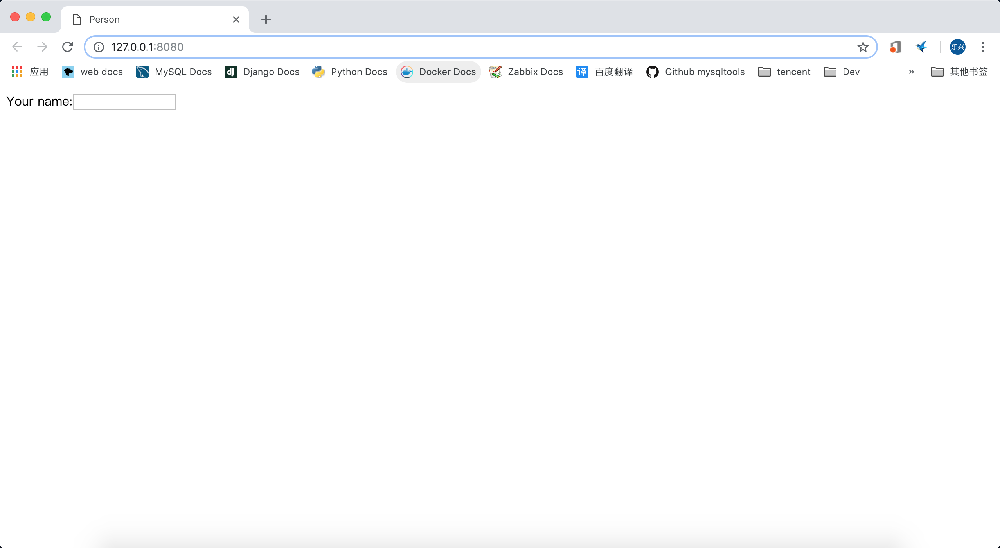
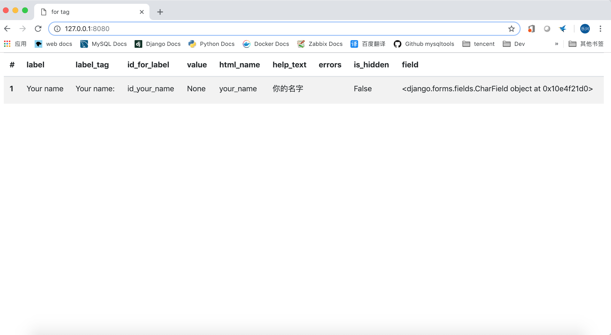
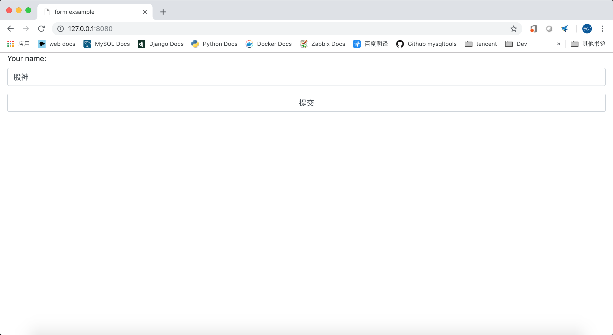

# django2docs

主编&作者:**蒋乐兴**

wechat:**jianglegege**

email:**1721900707@qq.com**

homepage:**https://www.sqlpy.com**

---

- [简介](#简介)
- [例子](#例子)
- [form在网站建设中的样板代码](#form在网站建设中的样板代码)
- [form与template一起配合使用](#form与template一起配合使用)
- [form的类型](#form的类型)
- [widget属性](#widget属性)
- [form的几个渲染选项](#form的几个渲染选项)
- [手工渲染form](#手工渲染form)


## 简介
   **django中的Form类用于创建表单，最强的一点是它可以与Model结合，进而大大的减化了增删改查的逻辑**

   ---

## 例子
   **0、假设我们要创建这么一个表单**
   ```html
   <form action="/your-name/" method="post">
       <label for="your_name">Your name: </label>
       <input id="your_name" type="text" name="your_name" value="{{ current_name }}">
       <input type="submit" value="OK">
   </form>
   ```
   **1、创建一个用于填写your_name的表单**
   ```python
   from django import forms
   
   class NameForm(forms.Form):
       your_name = forms.CharField(label='Your name', max_length=100)
   ```
   **2、创建一个用于显示form的值**
   >form是自带显示能力的，所以直接{{ from }}就是了
   ```html
   <!DOCTYPE html>
   <html>
       <head>
           <title>Person</title>
       </head>
       <body>
           <form action="./" method="GET" >
               {{ form }}
           </form>
       </body>
   </html>
   ```

   
   
   **渲染后的代码**

   ```html
   <!DOCTYPE html>
   <html>
       <head>
           <title>Person</title>
       </head>
       <body>
           <form action="./" method="GET" >
               <tr><th><label for="id_your_name">Your name:</label></th><td><input type="text" name="your_name" maxlength="100" required id="id_your_name"></td></tr>
           </form>
       </body>
   </html>
   ```

   ---

## form在网站建设中的样板代码
   **function view的样板代码**
   ```python
   def get_name(request):
       # if this is a POST request we need to process the form data
       if request.method == 'POST':
           # create a form instance and populate it with data from the request:
           form = NameForm(request.POST)
           # check whether it's valid:
           if form.is_valid():
               # process the data in form.cleaned_data as required
               # ...
               # redirect to a new URL:
               return HttpResponseRedirect('/thanks/')
   
       # if a GET (or any other method) we'll create a blank form
       else:
           form = NameForm()
   
       return render(request, 'name.html', {'form': form})
   ```
   **1、** 如果http请求是以`get`方式发来的，django会直接创建表单实例并把这个实例绑定到上下文对象当中，传给模板渲染

   **2、** 如果http语法是以`post`方式发来的话，先用request.POST字典构造出form实例(这个动作叫绑定数据到表单);调用is_valid方法如果返回`True`说明校验成功了；就可以通过cleaned_data来访问数据了。

   ---

## form与template一起配合使用
   **在模板中使用表单的例子**
   ```html
   <form action="/your-name/" method="post">
       
       {{ form }}
       <input type="submit" value="Submit">
   </form>
   ```
   **1、** 包装上`form`标签

   **2、** 增加上`csrf`保护

   **3、** 记得加上`submit`按钮

   ---

## form的类型
   **1、从表单有没有数据来区分**

   `A bound form`: 说的是这个实例保存了用户提交上来的数据

   `An unbound form`: 说的是这个实例是空的，它没有数据

   **2、从表单实例的类型出开**

   从类型上来年就`Form`和`ModelForm`两类

   ---

## widget属性
   **widget用来控制form在渲染标签时的所对应的type属性**

   如下CharField类型默认会被渲染成type=text类型
   ```python
   from django import forms
   
   class NameForm(forms.Form):
       your_name = forms.CharField(label='Your name', max_length=100)
   ```
   渲染后的结果
   ```html
   <input type="text" name="your_name" maxlength="100" required id="id_your_name">
   ```

   **覆盖默认值把type=text改成type=textarea**
   ```python
   class NameForm(forms.Form):
       your_name = forms.CharField(label='Your name', max_length=100,widget=forms.Textarea)
   ```
   >注意widget属性的值是一个forms.Textarea这个类，同样也可以是forms.Textarea()实例
   ```html
   <textarea name="your_name" cols="40" rows="10" maxlength="100" required id="id_your_name"></textarea>
   ```
   ---

## form的几个渲染选项
   **1、table的形式**
   ```html
   {{ form.as_table }}
   ```
   ```html
   <tr><th><label for="id_your_name">Your name:</label></th><td><textarea name="your_name" cols="40" rows="10" maxlength="100" required id="id_your_name">
</textarea></td></tr>
   ```
   **2、p的形式**
   ```html
   {{ form.as_p }}
   ```
   ```html
   <p><label for="id_your_name">Your name:</label> <textarea name="your_name" cols="40" rows="10" maxlength="100" required id="id_your_name">
</textarea></p>
   ```
   **3、li的形式**
   ```html
   {{ form.as_ul }}
   ```
   ```html
   <li><label for="id_your_name">Your name:</label> <textarea name="your_name" cols="40" rows="10" maxlength="100" required id="id_your_name">
</textarea></li>
   ```
   ---

## 手工渲染form
   **手工渲染的核心思想把通过一个for循环结合field的各个属性一步步的把form表单给“拼接”出来**
   ```python
   from django import forms
   
   class NameForm(forms.Form):
       your_name = forms.CharField(label='Your name',help_text="你的名字", max_length=100,widget=forms.TextInput(attrs={'class':'form-control'}))
   ```
   **1、field.label 对应的是label的值** `Your name`

   **2、field.label_tag 对应的是一个完整可用的label标签** `<label for="id_your_name">Your name:</label>`

   **3、field.id_for_label 对应的是与lable配对的input元素的id值** `id_your_name`

   **4、field.value 对应的是字段的值**

   **5、field.html_name 对应的是input元素在html标签中的名字** `your_name`

   **6、field.help_text 对应的是字段的help_text的值** `your_name`

   **7、field.errors 字段的错误列表** ``

   **8、field.is_hidden 字段是否是影藏的** `False`

   **9、field.field 对应的是字段对象本身**

   >在这些属性中只有field.label_tag 是一个鬼才它会直接以`<label for="id_xxx">xxx</label>`的方式渲染在页面中，并且不受safe过滤器的影响，铁骨铮铮。

   

   **一个渲染的例子**
   ```html
    <form class="form" method="GET" action="./">
        
        <div class="form-group">
            {{field.label_tag}}
            {{field}}
            
                <ul>
                    
                        {{error}}
                    
                </ul>
            
        </div>
        
        
        <input type="submit" value="提交" class="form-control">
    </form>
   ```
   浏览器结果

   
   
   ---


   