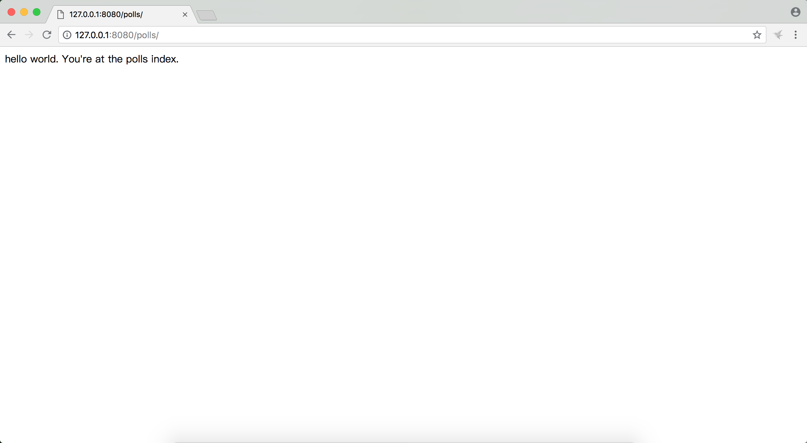

# django2docs

主编&作者:**蒋乐兴**

wechat:**jianglegege**

email:**1721900707@qq.com**

---

- [确认django是否安装成功](#确认django是否安装成功)
- [创建django项目](#创建django项目)
- [启动开发服务器](#启动开发服务器)
- [自定义开发服务器所监听的ip和端口](#自定义开发服务器所监听的ip和端口)
- [使用开发服务器进行开发的一个优势](#使用开发服务器进行开发的一个优势)
- [创建一个叫polls的app](#创建一个叫polls的app)
- [为polls这个app创建视图](#为polls这个app创建视图)
- [为polls创建url到view的映射文件urls.py文件](#为polls创建url到view的映射文件urls.py文件)
- [挂载polls的urls.py到根(mysite/urls.py)文件](#挂载polls的urls.py到根(mysite/urls.py)文件)
- [访问polls.view.index这个视图](#访问polls.view.index这个视图)
- [include函数的说明](#include函数的说明)
- [path函数的说明](#path函数的说明)
---


## 确认django是否安装成功
```bash
python3 -m django --version
```
```
2.1
```
---

## 创建django项目
   **django-admin startproject xxx 用于创建django项目、执行startproject后当前目录下生成对应项目文件**
   ```bash
   django-admin startproject mysite

   tree mysite
   ```
   ```
      mysite/
   ├── manage.py        #命令行工具、coder可以通过这个工具与当前django项目交互
   └── mysite
       ├── __init__.py  #标记文件、用于标记当前目录是一个python包
       ├── settings.py  #django项目的配置文件
       ├── urls.py      #url到view的路由定义
       └── wsgi.py      #wsgi入口点
   
   1 directory, 5 files
   ```
   也就是说一个django项目对外表现成一个python包

   ---

## 启动开发服务器
   **启动开发服务器、测试当前项目是否能正常访问、以此来判断项目是否创建成功**
   ```bash
   cd mysite
   python3 manage.py runserver
   ```
   ```
   Performing system checks...
   
   System check identified no issues (0 silenced).
   
   You have 15 unapplied migration(s). Your project may not work properly until you apply the migrations for app(s): admin, auth, contenttypes,    sessions.
   Run 'python manage.py migrate' to apply them.
   
   August 18, 2018 - 09:00:23
   Django version 2.1, using settings 'mysite.settings'
   Starting development server at http://127.0.0.1:8000/
   Quit the server with CONTROL-C.
   ```
   提示通过`http://127.0.0.1:8000/`这个url来访问项目

   

   开发服务器的目的是为了方便开发、决不要在生产环境上用这个服务器。在生产环境应该用ningx 、httpd这样的服务器软件

   ---

## 自定义开发服务器所监听的ip和端口
   **runserver 命令后面还可以接参数、可以通过这个参数来控制开发服务器所监听的ip和端口、大致格式如下 python3 manager.py runserver ip:port**
   ```
   python3 manage.py runserver 127.0.0.1:8080
   ```
   ```
   Performing system checks...
   
   System check identified no issues (0 silenced).
   
   You have 15 unapplied migration(s). Your project may not work properly until you apply the migrations for app(s): admin, auth, contenttypes,    sessions.
   Run 'python manage.py migrate' to apply them.
   
   August 18, 2018 - 09:10:19
   Django version 2.1, using settings 'mysite.settings'
   Starting development server at http://127.0.0.1:8080/
   Quit the server with CONTROL-C.
   ```
   ---

## 使用开发服务器进行开发的一个优势
   **开发服务器会为每一个请求重新加载一遍整个项目的.py文件，如果这些.py文件有更新的话，这样就不需要每次更新代码都重启web服务器，减少工作量。**

   ---

## 创建一个叫polls的app
   **一个app是一组功能的集合、一个项目就是一个站点、它包含一组配置和app**
   ```bash
   cd mysite
   python3 manage.py startapp polls
   tree ./
   ```
   ```
   ./
   ├── db.sqlite3
   ├── manage.py
   ├── mysite
   │   ├── __init__.py
   │   ├── __pycache__
   │   │   ├── __init__.cpython-36.pyc
   │   ├── settings.py
   │   ├── urls.py
   │   └── wsgi.py
   └── polls                  #可见所谓的app也就是表现为python的一个包
       ├── __init__.py
       ├── admin.py           #
       ├── apps.py            #
       ├── migrations         #SQL迁移的中间文件
       │   └── __init__.py
       ├── models.py
       ├── tests.py            #定义测试用例的文件
       └── views.py            #保存视图的文件
   
   4 directories, 17 files
   ```
   ---

## 为polls这个app创建视图
   **视图是一个独立的功能点、它接受一个http请求、返回一个http响应** 定义一个返回hello world 的视图
   `polls/view.py`文件中创建如下视图
   ```python
   from django.shortcuts import render
   from django.http import HttpResponse
   # Create your views here.
   
   def index(request):
       return HttpResponse("hello world. You're at the polls index.")
   ```
   ---

## 为polls创建url到view的映射文件urls.py文件
   ```bash
   cd polls
   touch urls.py
   ```
   polls/urls.py内容如下
   ```python
   from .views import index
   from django.urls import path
   
   urlpatterns=[
       path('',index,name='index'),
   ]
   ```
   ---

## 挂载polls的urls.py到根(mysite/urls.py)文件
   挂载polls.urls.py后的mysite/urls.py内容如下
   ```python
   """mysite URL Configuration
   
   The `urlpatterns` list routes URLs to views. For more information please see:
       https://docs.djangoproject.com/en/2.1/topics/http/urls/
   Examples:
   Function views
       1. Add an import:  from my_app import views
       2. Add a URL to urlpatterns:  path('', views.home, name='home')
   Class-based views
       1. Add an import:  from other_app.views import Home
       2. Add a URL to urlpatterns:  path('', Home.as_view(), name='home')
   Including another URLconf
       1. Import the include() function: from django.urls import include, path
       2. Add a URL to urlpatterns:  path('blog/', include('blog.urls'))
   """
   from django.contrib import admin
   from django.urls import path,include
   
   urlpatterns = [
       path('admin/', admin.site.urls),
       path('polls/',include('polls.urls')), #这里的意思就是通过polls路径访问polls这个app的view
   ]
   ```
   ---

## 访问polls.view.index这个视图
   **根据之前的配置polls.view.index这个视图的访问路径应该是/polls/**

   

   ---

## include函数的说明
   **include(other_urls)函数用于引用其它的urls.py文件、用以实现app的可插拔**

   ---

## path函数的说明
   **path(router,view,kwargs,name) path函数要求两个必要的参数router & view 其它两个可选的**

   **1、router** 一个包含url的通配符、当一个请求到来时django会通过根urlpatterns列表来模式匹配(从上自下、一旦命中就不在往下面找了)；注意这个router中不包含请求的"参数"和站点的"域名"，也就是说`https://www.example.com/myapp/` & `https://www.example.com/myapp/?page=3` 都指向`myapp/`这一个通配符。

   **2、view** 对应通配符的回调方法

   **3、kwargs** 可选的传递给view的kwargs字典

   **4、name** 可选的名称，template中可以用这个名称解析出url

   ---

## 示例代码
   **Tutorials/codes/part1**


