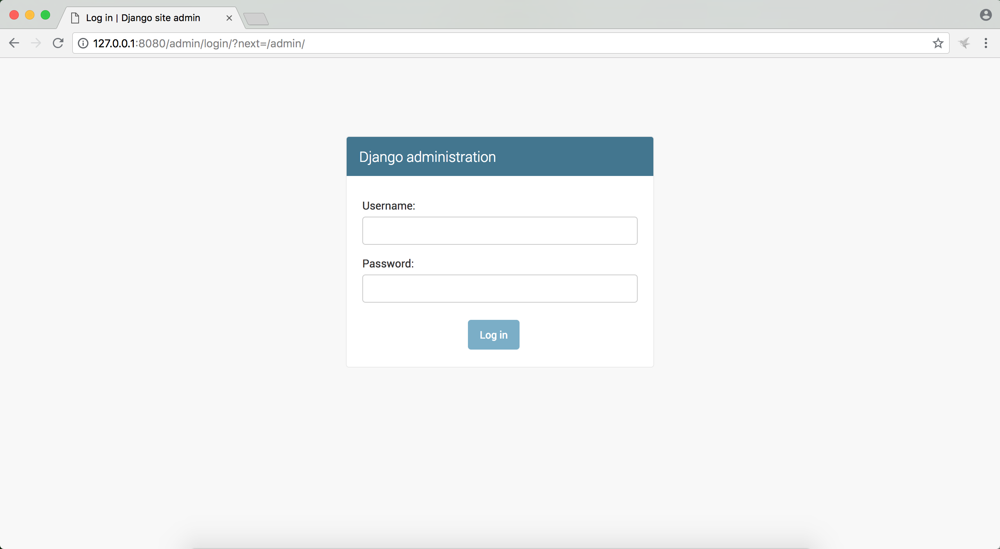
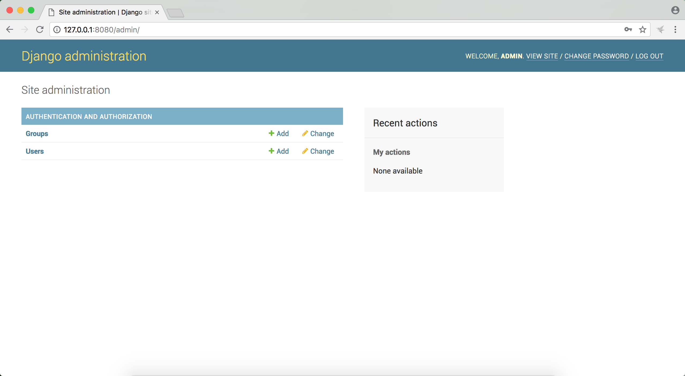
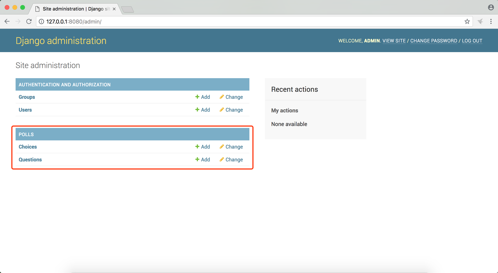
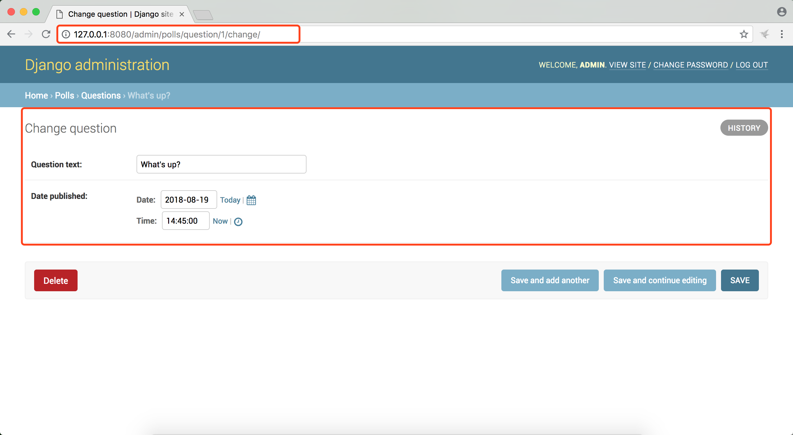

# django2docs

主编&作者:**蒋乐兴**

wechat:**jianglegege**

email:**1721900707@qq.com**

---

- [序言](#序言)
- [配置项目要使用的后台数据库](#配置项目要使用的后台数据库)
- [配置时区信息](#配置时区信息)
- [INSTALLED_APPS](#INSTALLED_APPS)
- [创建模型](#创建模型)
- [激活模型](#激活模型)
- [生成迁移的临时文件](#生成迁移的临时文件)
- [执行迁移](#执行迁移)
- [通过djangoAPI与数据库进行交互](#通过djangoAPI与数据库进行交互)
- [增加数据处理逻辑](#增加数据处理逻辑)
- [通过djangoshell试用model中定义的API](#通过djangoshell试用model中定义的API)
- [访问admin站点](#访问admin站点)
- [把app纳入到admin站点](#把app纳入到admin站点)
- [示例代码](#示例代码)
---

## 序言
   在前一部分create-a-basic-application-poll中体会到了django中一个完整的“请求--处理--响应”的过程，然django真正的优势是能非常方便的开发“数据驱动的网站”，本节主要介绍通过django自带的ORM来完成数据模型的定义。

   ---

## 配置项目要使用的后台数据库
   `mysite/settings.py`文件为项目的配置文件，程序要连接的数据库就是在这个文件中定义的，与其它语言对数据库的配置不同django中数据库相关的配置并不是一个连接字符串，而是一个字典，默认情况下使用SQLite作为后台数据库。以下是默认情况下settings.py文件关于后台数据库的部分
   ```python
   DATABASES = {
       'default': {
           'ENGINE': 'django.db.backends.sqlite3',
           'NAME': os.path.join(BASE_DIR, 'db.sqlite3'),
       }
   }
   ```
   作为一个优秀的MySQL-DBA我当然是选择用MySQL啦、所以我会把配置改成如下形式
   ```python
   DATABASES = {
       'default':{
           'ENGINE': 'django.db.backends.mysql', # 后台数据库的类型
           'HOST': '127.0.0.1',                  # 后台数据库所在主机的ip我这里用本机
           'PORT': 3306,                         # 后台数据库所监听的端口
           'USER': 'appuser',                    # 连接数据库的用户名
           'PASSWORD': '123456',                 # 连接数据库的密码
           'NAME': 'tempdb',                     # 数据库中的schema名字
       }
   }
   ```
   在使用SQLite之外的其它数据库都要求有一个额外的步骤、那就是要事先在数据库中创建相应的schema、也就是我用MySQL做后台数据库的话、我要事先把`tempdb`这个schema给创建出来。
   ```sql
   create database tempdb;                                 -- 创建tempdb 这个schema

   create user 'appuser@'127.0.0.1 identified by '123456'; -- 创建数据库用户
   grant all on tempdb.* to 'appuser@'127.0.0.1;           -- 授权
   ```

   ---

## 配置时区信息
   **我服务器用的都是北京时间、所以项目中的时区配置就要配置成东八区的时间、可能通过如下命令获取当前主机的时区信息**
   ```bash
   timedatectl
   ```
   ```
         Local time: 日 2018-08-19 13:01:48 CST
     Universal time: 日 2018-08-19 05:01:48 UTC
           RTC time: 日 2018-08-19 05:01:51
          Time zone: Asia/Shanghai (CST, +0800) 
        NTP enabled: yes
   NTP synchronized: yes
    RTC in local TZ: no
         DST active: n/a
   ```
   由于某些原因东八区的字符表示形式不是   “亚洲/北京” 而是  “亚洲/上海 (Asia/Shanghai)” 所以我在settings.py中`TIME_ZONE `这一项就要改成`Asia/Shanghai`
   ```
   TIME_ZONE = 'Asia/Shanghai' # 设置时区为  亚洲/上海
   ```
   ---

## INSTALLED_APPS
   **INSTALLED_APPS**是django中比较重要的一个配置项、这个列表中指定当前项目中处理激活状态的app、初始状态下的配置如下
   ```python
   INSTALLED_APPS = [
       'django.contrib.admin',
       'django.contrib.auth',
       'django.contrib.contenttypes',
       'django.contrib.sessions',
       'django.contrib.messages',
       'django.contrib.staticfiles',
   ]
   ```
   可以看到初始状态下只有几个内部的app被激活了，一旦app被激活那么这个app中定义的表就可以被migrate命令迁移到数据库中
   ```bash
   python3 manage.py migrate
   ```
   ```
   Operations to perform:
     Apply all migrations: admin, auth, contenttypes, sessions
   Running migrations:
     Applying contenttypes.0001_initial... OK
     Applying auth.0001_initial... OK
     Applying admin.0001_initial... OK
     Applying admin.0002_logentry_remove_auto_add... OK
     Applying admin.0003_logentry_add_action_flag_choices... OK
     Applying contenttypes.0002_remove_content_type_name... OK
     Applying auth.0002_alter_permission_name_max_length... OK
     Applying auth.0003_alter_user_email_max_length... OK
     Applying auth.0004_alter_user_username_opts... OK
     Applying auth.0005_alter_user_last_login_null... OK
     Applying auth.0006_require_contenttypes_0002... OK
     Applying auth.0007_alter_validators_add_error_messages... OK
     Applying auth.0008_alter_user_username_max_length... OK
     Applying auth.0009_alter_user_last_name_max_length... OK
     Applying sessions.0001_initial... OK
   ```
   migrate后app中定义的表就会同步到数据库中、我们在数据库可以看到如下内容
   ```sql
   use tempdb;
   Reading table information for completion of table and column names
   You can turn off this feature to get a quicker startup with -A
   
   Database changed
   mysql> show tables;
   +----------------------------+
   | Tables_in_tempdb           |
   +----------------------------+
   | auth_group                 |
   | auth_group_permissions     |
   | auth_permission            |
   | auth_user                  |
   | auth_user_groups           |
   | auth_user_user_permissions |
   | django_admin_log           |
   | django_content_type        |
   | django_migrations          |
   | django_session             |
   +----------------------------+
   10 rows in set (0.00 sec)
   ```

   ---

## 创建模型
   django中通过模型(model)来定义一张数据库中表、在INSTALLED_APPS这一节中看到了migrate会在数据库端生成表、这些表在django中就是通过model定义的；现在我为polls这个app增加两个模型。
   polls/models.py文件的内容如下
   ```python
   from django.db import models
   
   # Create your models here.
   
   class Question(models.Model):
       question_text = models.CharField(max_length=200)
       pub_date = models.DateTimeField('date published')
   
   
   class Choice(models.Model):
       question = models.ForeignKey(Question, on_delete=models.CASCADE)
       choice_text = models.CharField(max_length=200)
       votes = models.IntegerField(default=0)
   ```

   ---

## 激活模型
   **激活模型就是把模型所在的app配置到INSTALLED_APPS列表中**
   ```python
   INSTALLED_APPS = [
       'polls',               # 把app的名字增加到列表中就可以激活app中的模型了
       'django.contrib.admin',
       'django.contrib.auth',
       'django.contrib.contenttypes',
       'django.contrib.sessions',
       'django.contrib.messages',
       'django.contrib.staticfiles',
   ]
   ```
   ---

## 生成迁移的临时文件
   **makemigrations子命令用于生成迁移的临时文件**
   ```
   python3 manage.py makemigrations polls
   ```
   ```
   Migrations for 'polls':
     polls/migrations/0001_initial.py
       - Create model Choice
       - Create model Question
       - Add field question to choice
   ```
   这个会操作会生成若干个物理文件，这些文件都在migrations目录下
   ```bash
   tree polls
   ```
   ```
   polls/
   ├── __init__.py
   ├── __pycache__
   │   ├── __init__.cpython-36.pyc
   │   ├── admin.cpython-36.pyc
   │   ├── models.cpython-36.pyc
   │   ├── urls.cpython-36.pyc
   │   └── views.cpython-36.pyc
   ├── admin.py
   ├── apps.py
   ├── migrations
   │   ├── 0001_initial.py    #这个就是这次人生成的迁移的临时物理文件
   │   ├── __init__.py
   │   └── __pycache__
   │       └── __init__.cpython-36.pyc
   ├── models.py
   ├── tests.py
   ├── urls.py
   └── views.py
   ```
   ---

## 执行迁移
   **migrate子命令会执行迁移操作**
   ```bash
   python3 manage.py migrate
   ```
   ```
   Operations to perform:
     Apply all migrations: admin, auth, contenttypes, polls, sessions
   Running migrations:
     Applying polls.0001_initial... OK
   ```
   之前说过所谓的迁移就是把python定义的model映射成数据库中的表、可以在数据库看一下这次迁移生成了哪些表
   ```sql
   use tempdb;
   Reading table information for completion of table and column names
   You can turn off this feature to get a quicker startup with -A
   
   Database changed
   show tables;
   +----------------------------+
   | Tables_in_tempdb           |
   +----------------------------+
   | auth_group                 |
   | auth_group_permissions     |
   | auth_permission            |
   | auth_user                  |
   | auth_user_groups           |
   | auth_user_user_permissions |
   | django_admin_log           |
   | django_content_type        |
   | django_migrations          |
   | django_session             |
   | polls_choice               |
   | polls_question             |
   +----------------------------+
   12 rows in set (0.00 sec)
   ```
   可以看到polls定义的choice和question这两个model已经被映射成了polls_choice 和 polls_question表；两张表的定义如下
   ```sql
   CREATE TABLE `polls_choice` (
     `id` int(11) NOT NULL AUTO_INCREMENT,
     `choice_text` varchar(200) NOT NULL,
     `votes` int(11) NOT NULL,
     `question_id` int(11) NOT NULL,
     PRIMARY KEY (`id`),
     KEY `polls_choice_question_id_c5b4b260_fk_polls_question_id` (`question_id`),
     CONSTRAINT `polls_choice_question_id_c5b4b260_fk_polls_question_id` FOREIGN KEY (`question_id`) REFERENCES `polls_question` (`id`)
   ) ENGINE=InnoDB DEFAULT CHARSET=utf8 ;
   
   CREATE TABLE `polls_question` (
     `id` int(11) NOT NULL AUTO_INCREMENT,
     `question_text` varchar(200) NOT NULL,
     `pub_date` datetime(6) NOT NULL,
     PRIMARY KEY (`id`)
   ) ENGINE=InnoDB DEFAULT CHARSET=utf8;

   ```
   ---

## 通过djangoAPI与数据库进行交互
   **本来与数据库交互就是要使用SQL语言的、但是问题是并不是每一个开发人员都精通SQL的、django通过自定义ORM的方式让开发人员能通过python语言与数据库进行交互**
   ```bash
   python3 manage.py shell
   ```
   ```python
   from polls.models import Choice, Question
   Question.objects.all()
   #<QuerySet []>

   from django.utils import timezone
   q = Question(question_text="What's new?", pub_date=timezone.now())
   q.save()
   q.id
   #1
   q.question_text
   #"What's new?"
   q.pub_date
   #datetime.datetime(2018, 8, 19, 6, 45, 0, 290419, tzinfo=<UTC>)
   q.question_text = "What's up?"
   q.save()
   Question.objects.all()
   #<QuerySet [<Question: Question object (1)>]>
   ```
   可以看到对象的黑夜打印方式是有问题的`<Question: Question object (1)>`这样的输出并不好确认对象是多少、针对这个问题可能通过定义`__str__`这个魔术方法来定义打印时的显示值
   ```python
   from django.db import models
   
   # Create your models here.
   
   class Question(models.Model):
       question_text = models.CharField(max_length=200)
       pub_date = models.DateTimeField('date published')
   
       def __str__(self):
           return self.question_text
   
   
   class Choice(models.Model):
       question = models.ForeignKey(Question, on_delete=models.CASCADE)
       choice_text = models.CharField(max_length=200)
       votes = models.IntegerField(default=0)
   
       def __str__(self):
           return self.choice_text
   ```
   重新启动shellAPI
   ```
   python3 manage.py shell
   ```
   ```python
   from polls.models import Choice, Question
   Question.objects.all()
   #<QuerySet [<Question: What's up?>]>
   ```
   可见__str__魔术方法在一个model中的重要性

   ---

## 增加数据处理逻辑
   **model是基本的部分是"字段"或说是数据库中的“列”，还有一个非常重要的部分是“方法”，方法是对行进行的操作，这里契合OOP的思想----class是数据和方法的有机结合**

   给Question类增加一个方法，用户判断当前的Question是不是最近发布的
   ```python
   import datetime
   from django.utils import timezone
   from django.db import models
   
   # Create your models here.
   
   class Question(models.Model):
       question_text = models.CharField(max_length=200)
       pub_date = models.DateTimeField('date published')
   
       def __str__(self):
           return self.question_text
   
       def was_published_recently(self):
           """
           timezone.now() - datetime.timedelta(days=1) 表示的是当前时间减去一天、也就是昨天
           如果发布时间比较昨天大那么就认为是最近发布的
           """
           return self.pub_date >= timezone.now() - datetime.timedelta(days=1)
   
   
   class Choice(models.Model):
       question = models.ForeignKey(Question, on_delete=models.CASCADE)
       choice_text = models.CharField(max_length=200)
       votes = models.IntegerField(default=0)
   
       def __str__(self):
           return self.choice_text
   ```
   ---
   
## 通过djangoshell试用model中定义的API
   ```python
   import django
   django.setup()

   from polls.models import Question,Choice
   from datetime import datetime

   datetime.now()
   #datetime.datetime(2018, 8, 21, 20, 37, 55, 714466)

   Question.objects.all()
   #<QuerySet [<Question: What's up?>]>

   question = Question.objects.get(id=1)
   question.pub_date
   #datetime.datetime(2018, 8, 19, 6, 45, 0, 290419, tzinfo=<UTC>)

   question.was_published_recently()
   #False
   
   ```

   ---

## 访问admin站点
   **首先说明django是自带admin管理站点的、通过`admin/`这条url就可能问题到它、由于安全上的原因这个页面是要登录才能用的，同样出于安全的原因django并没有设定默认的用户名和密码、这个要我们自己去增加**

   **增加管理员账号和密码**
   ```bash
   python3 manage.py createsuperuser
   Username (leave blank to use 'jianglexing'): admin
   Email address: 1721900707@qq.com
   Password: 
   Password (again): 
   This password is too short. It must contain at least 8 characters.
   This password is too common.
   Bypass password validation and create user anyway? [y/N]: y
   Superuser created successfully.
   ```
   
   **启动开发服务器服务器**
   
   ```shell
   python3 manage.py runserver 127.0.0.1:8080
   Performing system checks...
   
   System check identified no issues (0 silenced).
   August 21, 2018 - 20:47:23
   Django version 2.1, using settings 'mysite.settings'
   Starting development server at http://127.0.0.1:8080/
   Quit the server with CONTROL-C.
   ```

   **通过`http://127.0.0.1:8080/admin`路径访问admin站点**

   

   

   ---

## 把app纳入到admin站点
   **在polls/admin.py文件中增加如下内容**
   ```python
   from django.contrib import admin
   
   # Register your models here.
   from .models import Question,Choice
   
   admin.site.register(Question) # 把Question纳入admin站点的管理
   admin.site.register(Choice)   # 把Choice纳入admin站点的管理
   ```
   **刷新页面查看变化**
   
   由上图可见Question、Choice已经可以编辑了。

   **前文中提到了model有两个基本的部分一个是“字段”另一个是“方法”，其中字段有两文面的含意1):它决定了数据库中列的数据类型，2):它决定了html页面中列在渲染时所对应的效果，可以看到界面中question_text,pub_date两个列的表现形式完全不同**
   

   ---

## 示例代码
   **Tutorials/codes/part2**

---
   


