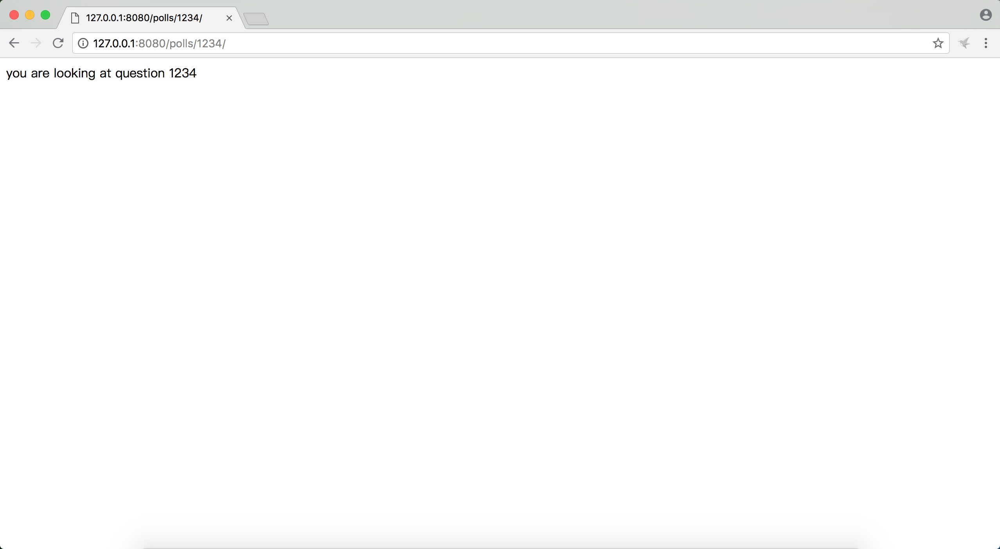
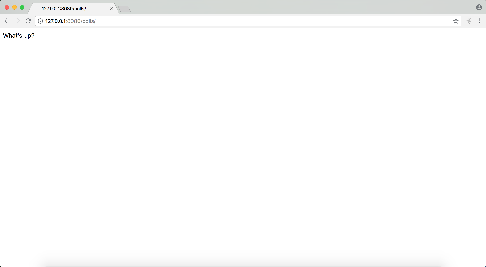
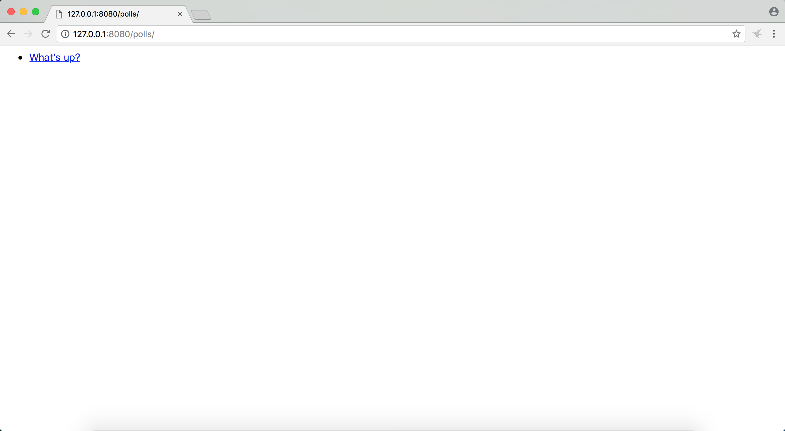
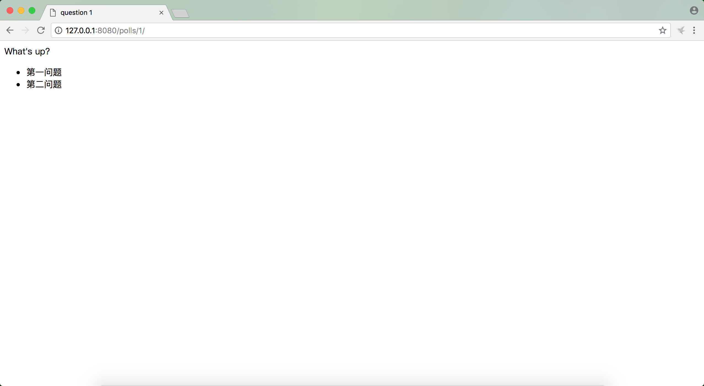
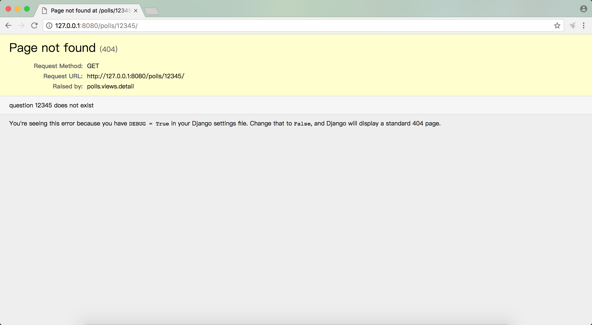

# django2docs

主编&作者:**蒋乐兴**

wechat:**jianglegege**

email:**1721900707@qq.com**

homepage:**http://www.sqlpy.com**

---

- [view的定义](#view的定义)
- [给polls.views.py增加向个简单的view](#给polls.views.py增加向个简单的view)
- [URL配置](#URL配置)
- [URL配置是怎么生效的](#URL配置是怎么生效的)
- [写一个真的能做点事的view](#写一个真的能做点事的view)
- [引入模板来解偶合](#引入模板来解偶合)
- [用模板的方法来重写index这个view](#用模板的方法来重写index这个view)
- [封装在使用template这种情况下的变化点](#封装在使用template这种情况下的变化点)
- [Raise404](#Raise404)
- [get_object_or_404](#get_object_or_404)
- [移除模板中的硬编码url](#移除模板中的硬编码url)
- [给url加上全名空间](#给url加上全名空间)

---

## view的定义
   **view是一个可调用的对象它接受一个HttpRequest对象作为输入，并以一个HttpResponse对象作为输出，HttpResponse的常见形式是一个web页面**

   ---

## 给polls.views.py增加向个简单的view
   polls.views.py内容如下:
   ```python
   from django.shortcuts import render
   from django.http import HttpResponse
   # Create your views here.
   
   def index(request):
       return HttpResponse("hello world. You're at the polls index.")
   
   def detail(request,question_id):
       """
       """
       return HttpResponse("you are looking at question {0}".format(question_id))
   
   def results(request,question_id):
       """
       """
       return HttpResponse("your are looking at result of question {0}".format(question_id))
   
   def vote(request,question_id):
       """
       """
       return HttpResponse("you are voting on question {0}".format(question_id))
   ```
   上面是几个标准的view的定义，以detail这个view来说，它是一个可调用的对象(函数自然是可调用的啦)并且接受一个HttpRequest(request)对象作为参数，返回一个HttpResponse类型的对象。

   **有了view还不是全部，用户是通过url来访问web页面的，所以还要加一层映射来关联url和view**

   ---

## URL配置
   **url配置可以完成url到view的映射关系，当用户访问对应的url的时候就调用对应的view，view的返回值就作为用户接收到的页面**

   polls.urls.py内容如下：
   ```python
   from .views import index,detail,vote,results
   from django.urls import path
   
   urlpatterns=[
       path('',index,name='index'),
       path('<int:question_id>/',detail,name='detail'),
       path('<int:question_id>/results/',results,name='results'),
       path('<int:question_id>/vote/',vote,name='vote'),
   ]
   ```
   项目的url配置如下：
   ```python
   """mysite URL Configuration
   
   The `urlpatterns` list routes URLs to views. For more information please see:
       https://docs.djangoproject.com/en/2.1/topics/http/urls/
   Examples:
   Function views
       1. Add an import:  from my_app import views
       2. Add a URL to urlpatterns:  path('', views.home, name='home')
   Class-based views
       1. Add an import:  from other_app.views import Home
       2. Add a URL to urlpatterns:  path('', Home.as_view(), name='home')
   Including another URLconf
       1. Import the include() function: from django.urls import include, path
       2. Add a URL to urlpatterns:  path('blog/', include('blog.urls'))
   """
   from django.contrib import admin
   from django.urls import path,include
   
   urlpatterns = [
       path('admin/', admin.site.urls),
       path('polls/',include('polls.urls')), #这里说明polls.view已经挂载到了根url配置
   ]
   ```

   ---

## URL配置是怎么生效的
   **项目中的settings.py中定义了哪个是url的根配置**
   ```python
   ROOT_URLCONF = 'mysite.urls'
   ```
   ROOT_URLCONF指明了整个项目的url路径映射要从mysite.urls这个文件中定义的urlpatterns作为根

   以`polls/1234/`这个url为例来讲解url的匹配过程

   1、从根url配置开始比，由于`polls/1234/`以`polls/`打头所以它自然匹配到`path('polls/',include('polls.urls'))`

   2、于是把`polls/1234/`的后面部分`1234/`交由`polls.urls`进行匹配，在这里直接命中了第二条`path('<int:question_id>/',detail,name='detail')`

   3、django在做url匹配时的一些规则 1):自上而下的匹配 2):一旦找到匹配的项那么匹配工作完成

   
   可以view的返回值作为了用户请求页面的返回

   ---

## 写一个真的能做点事的view
   **写一个view查询出最近5个Question对象的question_text**
   ```python
   def index(request):
       """
       """
       latest_question_list = Question.objects.all().order_by('-pub_date')[:5]
       output = ','.join([question.question_text for question in latest_question_list])
       return HttpResponse(output)
   ```
   
   上面代码存在的问题 1): 偶合的太紧了如果我们要改变网页的样式就一定要改变index这个view,也就是说我们为了改变html而不得不去改变python.

   ---

## 引入模板来解偶合
   **前面的内容可以看出直接通过python输出html的方式是比较暴力的，django通过模板的引入来解除偶合**

   django项目的settings.py文件中有定义与模板相关的内容
   ```python
   TEMPLATES = [
       {
           'BACKEND': 'django.template.backends.django.DjangoTemplates',
           'DIRS': [],
           'APP_DIRS': True, #这一行指出了是不是要在APP的目录下寻找模板文件
                             #也就是说django会查看APP目录下的templates目录中有没有对应的模板文件
           'OPTIONS': {
               'context_processors': [
                   'django.template.context_processors.debug',
                   'django.template.context_processors.request',
                   'django.contrib.auth.context_processors.auth',
                   'django.contrib.messages.context_processors.messages',
               ],
           },
       },
   ]
   ```
   在polls APP下创建templates子目录
   ```bash
   cd polls
   mkdir -p templates/polls/
   ```
   这里有一个官方推荐的小技巧，在templates目录下创建一个APP的同名目录，这样在引用模板文件的时候就可以比较好区分这个文件来自于哪个APP了。

   增加模板文件`templates/polls/index.html`
   ```html
   
       <ul>
       
           <li><a href="/polls/{{ question.id }}/">{{ question.question_text }}</a></li>
       
       </ul>
   
       <p>No polls are available.</p>
   
   ```

   ---

## 用模板的方法来重写index这个view
   ```python
   def index(request):
       """
       """
       latest_question_list = Question.objects.all().order_by('-pub_date')[:5] #查询数据
       template = loader.get_template('polls/index.html')                      #加载模板
       context={'latest_question_list':latest_question_list}                   #构造上下文
       return HttpResponse(template.render(context,request))                   #返回渲染后的页面
   ```
   

   ---

## 封装在使用template这种情况下的变化点
   **可以看到在使用template的场景下有两个步骤是一定要有的 1):加载模板 2):渲染模板**
   ```python
   template = loader.get_template('polls/index.html')
   template.render(context,request)
   ```
   反正每次都要加载模板然后结合上下文渲染那何不把这个共同点封装一下呢？事实上django官方也看到了这个问题并且已经把简写的方法都写好了
   ```python
   from django.shortcuts import render,get_object_or_404

   def index(request):
       """
       """
       latest_question_list = Question.objects.all().order_by('-pub_date')[:5] #查询数据
       context={'latest_question_list':latest_question_list}                   #构造上下文
       return render(request,'polls/index.html',context=context)               #渲染页面并返回
   ```
   
   总的来说一个view的返回值可以分两类 1):HttpResponse 2):Exception(Http404)

   ---

## Raise404
   **增加一个页面用于查看Question实例的详情(url中传入要查看qeustion对象的id)，如果没有对应id的question对象那么就报404**
   ```python
   def detail(request,question_id):
       """
       """
       try:
           question = Question.objects.get(pk=question_id) #从数据库中查询对象
       except Question.DoesNotExist as e:                  #如果没有找到对应的对象，那么就直接报404异常
           raise Http404("question {0} does not exist".format(question_id)) #注意404不是一个HttpResponse面是一个Exception
       context={'question':question}                       #如果能直接到这里说明有这个对象存在，那么构造上下文
       return render(request,'polls/detail.html',context=context)
   ```
   polls/detail.html内容如下：
   ```html
   <html>
       <head>
           <title> question {{question.id}}</title>
       </head>
       <body>
           <p>{{question.question_text}}</p>
           <ul>
           
               <li>{{choice.choice_text}}</li>
           
           </ul>
       </body>
   </html>
   ```
   
   当我们访问一个不存在的question id 的时候就报404NotFound
   
   上面的逻辑用中文可以这样描述，找到了对应的对象就输出它的内容，如果没有找到的话就直接报错；在许多情况下这个是一个非常常用的功能，django也对这个做了封装
   
   ---

## get_object_or_404
   **上文说到这种1)查询数据库 2)数据存在就输出 3)数据不存在就报404的需求是非常常见的，django给出的封装写法为get_object_or_404**
   ```python
   from django.shortcuts import render,get_object_or_404

   def detail(request,question_id):
       """
       """
       question = get_object_or_404(Question,pk=question_id)
       return render(request,'polls/detail.html',{'question':question})
   ```
   把上面的代码改写之后发现只要两行就能解决问题了，是不是方便多了。

   ---

## 移除模板中的硬编码url
   **回头看一下之前写的polls/index.html，事实上它是有问题的，主要的一个问题是url硬编码了**
   ```html
   
       <ul>
       
           <li><a href="/polls/{{ question.id }}/">{{ question.question_text }}</a></li>
       
       </ul>
   
       <p>No polls are available.</p>
   
   ```
   可以看到`<li><a href="/polls/{{ question.id }}/">{{ question.question_text }}</a></li>`这一行是有问题的，如果哪一个urls.py中把detail这个view的访问路径给改了，而我们的模板还是按之前的路径来渲染页面的话就会有问题；先来看django提供的解决方案
   ```html
   
       <ul>
       
           <li><a href="">{{ question.question_text }}</a></li>
       
       </ul>
   
       <p>No polls are available.</p>
   
   ```
   可以看到django通过`` 去查找叫detail的url,这个detail就是urls.py中`path('<int:question_id>/',detail,name='detail'),`这一行中的name字段的值；也就是说只要url的name没有变你的url改成什么都不再影响模板

   ---

## 给url加上全名空间
   **上文中我们解决了在template中引用url的问题、有一个更深层次的问题被暴露了出来、那就是当有多个app都有一个叫index的url的时候我们的模板会引用谁呢？所以是时候给url引入全名空间了**

   命名空间在django中是在urls.py中加一个叫`app_name`的变量实现的
   ```python
   from .views import index,detail,vote,results
   from django.urls import path
   
   app_name="polls" #通过一个叫app_name的变量来作为app的命名空间
   urlpatterns=[
       path('',index,name='index'),
       path('<int:question_id>/',detail,name='detail'),
       path('<int:question_id>/results/',results,name='results'),
       path('<int:question_id>/vote/',vote,name='vote'),
   ]
   ```
   在template中使用的时候就可以加上命名空间前缀了
   ```html
   
       <ul>
       
           <li><a href="">{{ question.question_text }}</a></li>
       
       </ul>
   
       <p>No polls are available.</p>
   
   ```

   ---


