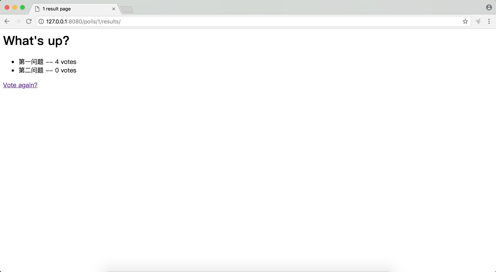

# django2docs

主编&作者:**蒋乐兴**

wechat:**jianglegege**

email:**1721900707@qq.com**

homepage:**http://www.sqlpy.com**

---

- [重写question对象的detail页面](#重写question对象的detail页面)
- [增加投票处理逻辑](#增加投票处理逻辑)
- [增加用于显示投票结果的result页面](#增加用于显示投票结果的result页面)
- [genericViews](#genericViews)
- [示例代码](#示例代码)
---

## 重写question对象的detail页面
   **在detail页面中加入投票功能**
   ```html
   <html>
       <head>
           <title> question {{question.id}}</title>
       </head>
       <body>
           <h2>{{ question.question_text }}</h2>
           <!-- 判断error_message是否为空 如若不是就打印error_message的值 -->
           <p><strong>{{ error_message }}</strong></p>
           
           <form action="" method="post">
           
           
               <input type="radio" name="choice" id="choice{{ forloop.counter }}" value="{{ choice.id }}">
               <label for="choice{{ forloop.counter }}">{{ choice.choice_text }}</label><br>
           
           <input type="submit" value="Vote">
           </form>
       </body>
   </html>
   ```
   由上面的代码可以看出 `radio` 标签的value值是choice的id 也就是说用户在投票时选择了哪个choice那么对应的choice的id就会被发往服务端。

   数据的提交方式使用的是`post`

   `forloop.counter`是模板语言的特殊语法用于对for循环进行计数

   ``针对`post`请求进行安全加固
   
   
   页面的源码如下

   ```html
   <html>
       <head>
           <title> question 1</title>
       </head>
       <body>
           <h2>What&#39;s up?</h2>

           <form action="/polls/1/vote/" method="post">
           <input type="hidden" name="csrfmiddlewaretoken" value="X9TIz7EIqlWHDHQsjeQThi3sHuygZf5q3UxTYiIz8hkSokj0JyvFE6hhGQUK5MFG">
           
               <input type="radio" name="choice" id="choice1" value="1">
               <label for="choice1">第一问题</label><br>
           
               <input type="radio" name="choice" id="choice2" value="2">
               <label for="choice2">第二问题</label><br>
           
           <input type="submit" value="Vote">
           </form>
       </body>
   </html>
   ```

   ---


## 增加投票处理逻辑
   **收到对应问题的投票后给票数据自增**
   ```python
   def vote(request,question_id):
       """
       """
       question = get_object_or_404(Question,pk=question_id)
       try:
           selected_choice = question.choice_set.get(pk=request.POST['choice'])
       except (KeyError,Choice.DoesNotExist) as e:
           context = {'question':question,'error_message':'You didn\'t select a choice.'}
           return render(request,'polls/vote.html',context=context)
       else:
           selected_choice.votes = selected_choice.votes + 1
           selected_choice.save()
           return HttpResponseRedirect(reverse('polls:results', args=(question.id,)))
   ```
   1): request.POST是一个类似于字典的对象，可以通过它来访问提交上来的数据，注意POST这个字典的值永远是string类型的

   2): request.GET和POST一样只不过它是用于get请求的

   3): 处理完POST请求后不应当直接返回一个HttpResponse对象，而是返回一个HttpResponseRedirect对象

   4): 通过reverse函数来规避url的硬编码

   ---

## 增加用于显示投票结果的result页面
   ```python
   def results(request,question_id):
       """
       """
       question = get_object_or_404(Question,pk=question_id)
       return render(request,'polls/results.html',{'question':question})
   ```
   模板的内容如下
   ```html
   <html>
       <head>
           <title>{{question.id}} result page</title>
       </head>
       <body>
           <h1>{{ question.question_text }}</h1>
   
           <ul>
           
               <li>{{ choice.choice_text }} -- {{ choice.votes }} vote{{ choice.votes|pluralize }}</li>
           
           </ul>
   
           <a href="">Vote again?</a>
       </body>
   </html>
   ```
   以下是给第一个答案投了4票的结果
   

   ---

## genericViews
   **从上面的几个view我们可以看出，无非都是根据url或请求中传入的参数在数据库查询到对应的数据，模板系统根据数据渲染模板，然后把渲染的结果返回给客户端；generic view把这一常见的“模式”给抽象出来，进一步做到少写代码也能解决问题**

   1): generic view 有个约定就是所有的数据要通过主键进行查询，主键在urls.py中的表现为`pk`参数，也就是说url中的参数不可以像之前那么随意了
   ```python
   from .views import index,detail,vote,results
   from django.urls import path
   from . import views
   
   app_name="polls" #通过一个叫app_name的变量来作为app的命名空间
   #urlpatterns=[
   #    path('',index,name='index'),
   #    path('<int:question_id>/',detail,name='detail'),
   #    path('<int:question_id>/results/',results,name='results'),
   #    path('<int:question_id>/vote/',vote,name='vote'),
   #]
   
   urlpatterns = [
       path('', views.IndexView.as_view(), name='index'),
       path('<int:pk>/', views.DetailView.as_view(), name='detail'),
       path('<int:pk>/results/', views.ResultsView.as_view(), name='results'),
       path('<int:question_id>/vote/', views.vote, name='vote'),
   ]
   #注意vote并没有pk参数而是保留着question_id参数,这个主要是因为vote不是通过generic view实现的
   ```
   2): 通过generic view实现常见功能
   ```python
   from django.views import generic
   def vote(request,question_id):
       """
       """
       question = get_object_or_404(Question,pk=question_id)
       try:
           selected_choice = question.choice_set.get(pk=request.POST['choice'])
       except (KeyError,Choice.DoesNotExist) as e:
           context = {'question':question,'error_message':'You didn\'t select a choice.'}
           return render(request,'polls/vote.html',context=context)
       else:
           selected_choice.votes = selected_choice.votes + 1
           selected_choice.save()
           return HttpResponseRedirect(reverse('polls:results', args=(question.id,)))
   
   
   class IndexView(generic.ListView):
       template_name = 'polls/index.html'
       context_object_name = 'latest_question_list'
   
       def get_queryset(self):
           """Return the last five published questions."""
           return Question.objects.order_by('-pub_date')[:5]
   
   
   class DetailView(generic.DetailView):
       model = Question
       template_name = 'polls/detail.html'
   
   
   class ResultsView(generic.DetailView):
       model = Question
       template_name = 'polls/results.html'
   ```
   1): 在个面的例子中使用到了两个generic view 一个是ListView另一个是DetailView，两个分别对应着“展示一组对象，展示某一特定对应的内容”

   2): 每一个generic view都要知道它自己要作用在的模块，这个可以通过model属性来指定

   3): 如果是一个DetailView的话它还期望一个对象的主键值，以便它去查询数据库，这个主键值在url的定义中叫`pk`

   4): template_name 可以显示的指定模板的名字，如果不指定的话DetailView会去找`<app name>/<model name>_detail.html` ListView会去找`<app name>/<model name>_list.html`

   5): context_object_name可以显示的定义模板上下文对象

   ---

## 示例代码
   **1): Tutorials/codes/part4_1**

   **2): Tutorials/codes/part4_2**

   ---
