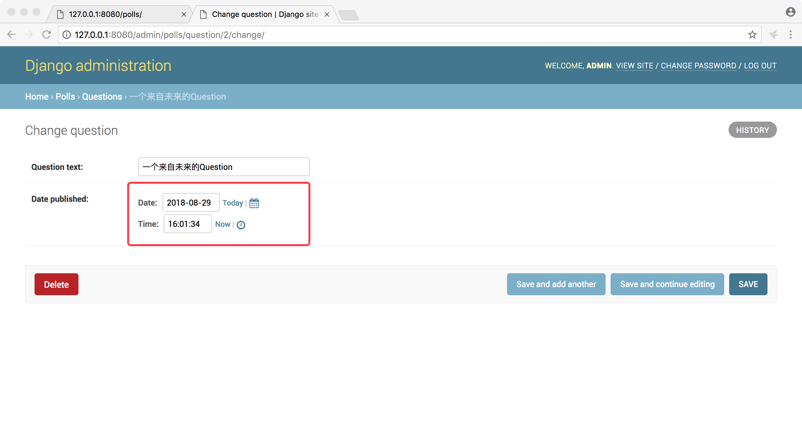
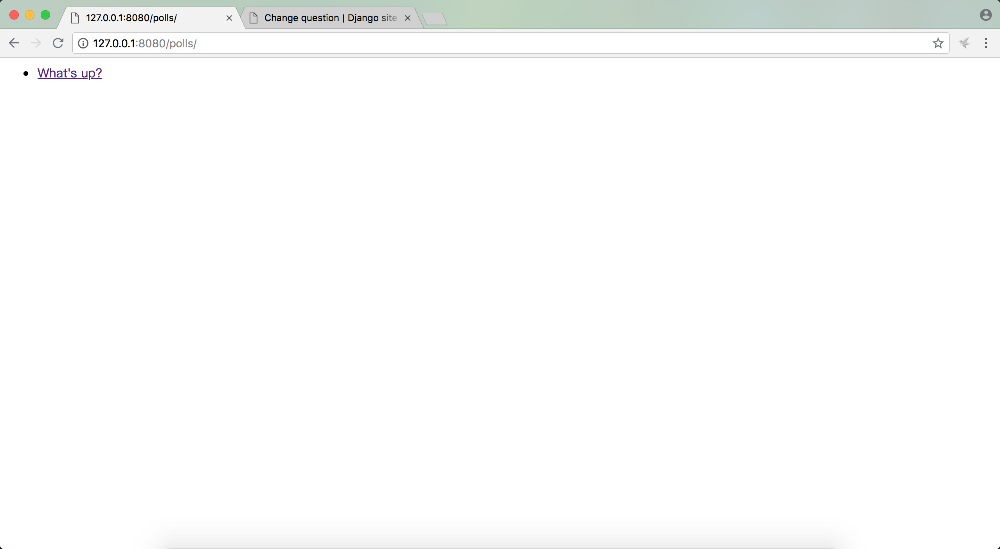
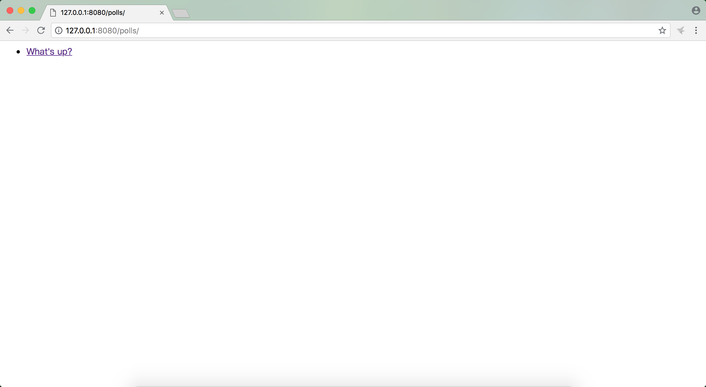
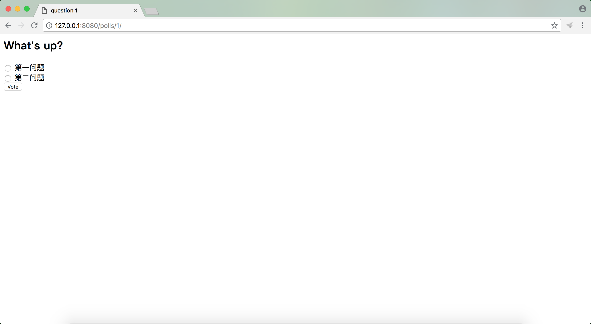
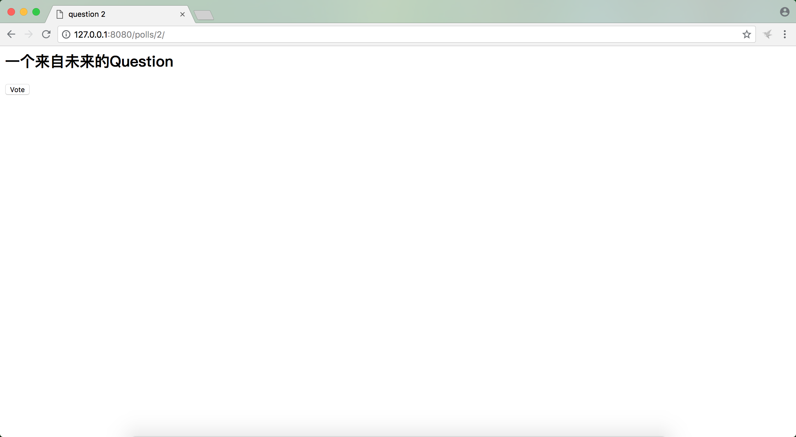
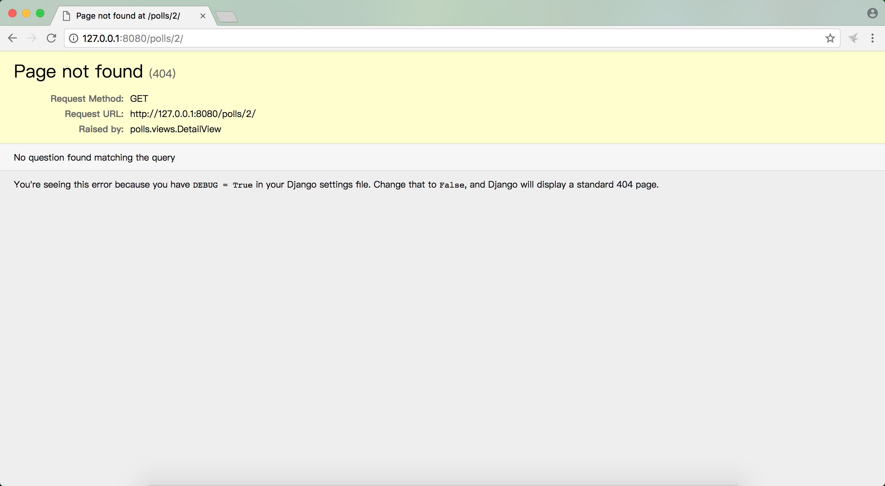

# django2docs

主编&作者:**蒋乐兴**

wechat:**jianglegege**

email:**1721900707@qq.com**

homepage:**http://www.sqlpy.com**

---

- [什么是自动化测试](#什么是自动化测试)
- [mysite项目中存在的一个bug](#mysite项目中存在的一个bug)
- [创建测试用例暴露问题](#创建测试用例暴露问题)
- [自动化测试背后的逻辑执行顺序](#自动化测试背后的逻辑执行顺序)
- [修复bug](#修复bug)
- [再次测试](#再次测试)
- [完善测试用例](#完善测试用例)
- [Client](#Client)
- [polls主页存在的问题](#polls主页存在的问题)
- [在浏览器中验证polls主页的修复效果](#在浏览器中验证polls主页的修复效果)
- [通过Client测试Listview](#通过Client测试Listview)
- [通过Client测试DetailView](#通过Client测试DetailView)
- [测试的越多越好](#测试的越多越好)
- [示例代码](#示例代码)


---

## 什么是自动化测试
   **自动化测试是一个例程，可以用它测试你的代码；测试操作可以在不同的层次进行，自动化测试通过系统自动完成，你只需要创建好你的测试代码，在你更新应用程序的代码后运行测试代码就可以发现你的更新是否引入了新的bug，重要的是这一切的测试工作是自动化的，要需要你手工的一个个的测试**

   ---

## mysite项目中存在的一个bug
   **Question对象的was_published_recently方法是有问题的**
   ```python
   class Question(models.Model):
       question_text = models.CharField(max_length=200)
       pub_date = models.DateTimeField('date published')
   
       def __str__(self):
           return self.question_text
   
       def was_published_recently(self):
           """
           timezone.now() - datetime.timedelta(days=1) 表示的是当前时间减去一天、也就是昨天
           如果发布时间比较昨天大那么就认为是最近发布的
           """
           return self.pub_date >= timezone.now() - datetime.timedelta(days=1)
   
   ```
   `was_published_recently`方法的内在逻辑是Question的发布时间大于昨天的这个时候就算是最近发布，也就是说如果把一个问题的pub_date填成未来，`was_published_recently`方法还会返回True

   ```python
   import django
   import datetime
   from polls.models import Question
   from django.utils import timezone
   
   future_question = Question(pub_date=timezone.now() + datetime.timedelta(days=30))
   future_question.was_published_recently()

   #True

   ```

   ---

## 创建测试用例暴露问题
   **polls/tests.py内容如下**
   ```python
   from django.test import TestCase
   from django.utils import timezone
   
   import datetime
   
   from .models import Question
   
   # Create your tests here.
   
   class QuestionModelTests(TestCase):
       """
       """
       def test_was_published_recently_with_future_question(self):
           """
           """
           #在当前时间的基础上加上30天
           time = timezone.now() + datetime.timedelta(days=30)
           #创建一个来自未来的问题对象
           future_question = Question(pub_date=time)
           #断言
           self.assertIs(future_question.was_published_recently(),False)
   ```
   运行自动化测试
   ```
   python3 manage.py test polls
   ```
   ```
   Creating test database for alias 'default'...
   System check identified no issues (0 silenced).
   F
   ======================================================================
   FAIL: test_was_published_recently_with_future_question (polls.tests.QuestionModelTests)
   ----------------------------------------------------------------------
   Traceback (most recent call last):
     File "/Users/jianglexing/Desktop/mysite/polls/tests.py", line 21, in test_was_published_recently_with_future_question
       self.assertIs(future_question.was_published_recently(),False)
   AssertionError: True is not False
   
   ----------------------------------------------------------------------
   Ran 1 test in 0.002s
   
   FAILED (failures=1)
   Destroying test database for alias 'default'...
   ```

   ---

## 自动化测试背后的逻辑执行顺序
   **1):** manage.py test polls 查找polls中的tests

   **2):** 发现 django.test.TestCase 的子类

   **3):** 创建用于测试的数据库

   **4):** 调用测试方法(测试方法是由一个约定来体现的，测试方法会以test打头)

   ---

## 修复bug
   **修复逻辑如下**
   ```python
   class Question(models.Model):
       question_text = models.CharField(max_length=200)
       pub_date = models.DateTimeField('date published')
   
       def __str__(self):
           return self.question_text
   
       #def was_published_recently(self):
       #    """
       #    timezone.now() - datetime.timedelta(days=1) 表示的是当前时间减去一天、也就是昨天
       #    如果发布时间比较昨天大那么就认为是最近发布的
       #    """
       #    return self.pub_date >= timezone.now() - datetime.timedelta(days=1)
       def was_published_recently(self):
           now = timezone.now()
           return now - datetime.timedelta(days=1) <= self.pub_date <= now
   ```
   ---

## 再次测试
   ```
    python3 manage.py test polls
   ```
   ```
   Creating test database for alias 'default'...
   System check identified no issues (0 silenced).
   .
   ----------------------------------------------------------------------
   Ran 1 test in 0.002s
   
   OK
   Destroying test database for alias 'default'...
   ```
   测试通过

   ---

## 完善测试用例
   ```python
   from django.test import TestCase
   from django.utils import timezone
   
   import datetime
   
   from .models import Question
   
   # Create your tests here.
   
   class QuestionModelTests(TestCase):
       """
       """
       def test_was_published_recently_with_future_question(self):
           """
           """
           #在当前时间的基础上加上30天
           time = timezone.now() + datetime.timedelta(days=30)
           #创建一个来自未来的问题对象
           future_question = Question(pub_date=time)
           #断言
           self.assertIs(future_question.was_published_recently(),False)
   
       def test_was_published_recently_with_old_question(self):
           """
           """
           #应该把timedelta看成一个绝对值，它是时间轴上一段长度的线段
           #也就是说如果往过去偏移、等同于在当前时间点上减去某一时间长度
           time = timezone.now() - datetime.timedelta(days=1,seconds=1)
           #一个来自24小时之前的问题
           old_question = Question(pub_date=time)
           #断言
           self.assertIs(old_question.was_published_recently(),False)
   
       def test_was_published_recently_with_recent_question(self):
           """
           """
           #增加一个时间点落在24小时内的Question对象
           time = timezone.now() - datetime.timedelta(hours=23,minutes=59,seconds=59)
           recent_question = Question(pub_date=time)
           self.assertIs(recent_question.was_published_recently(),True)
   ```
   测试方法的名字应该满足如下惯例 1): 以`test_`开头 2): 以`_with_xxx`结尾，结尾的后缀用户表示某一特定的场景

   ---

## Client
   **django提供了一个Client的类，这个类可以通过代码来模拟用户交互；这个类可以在tests.py中使用，它也可以在shell中使用，通过shell来试用Client类，想要在shell中使用Client类我们还要做些额外的事，导入setup_test_environment并执行它**
   ```
   python manager.py shell
   ``` 
   ```python
   from django.test.utils import setup_test_environment
   setup_test_environment()
   from django.test import Client

   client = Client()

   response = client.get('/')
   #Not Found: /

   response.status_code
   #404

   from django.urls import reverse
   response = client.get(reverse('polls:index'))
   response.status_code
   #200

   response.context
   #b'<!--\n    <ul>\n    \n        <li><a href="/polls/1/">What&#39;s up?</a></li>\n    \n    </ul>\n -->\n<!--\n\n    <ul>\n    \n        <li><a href="/polls/1/">What&#39;s up?</a></li>\n    \n    </ul>\n\n-->\n\n\n    <ul>\n    \n        <li><a href="/polls/1/">What&#39;s up?</a></li>\n    \n    </ul>\n\n'

   response.context['latest_question_list']
   #<QuerySet [<Question: What's up?>]>
   ```
   `setup_test_environment`会加载一个特别的模板渲染器，但是它并不会初始化测试数据库，也就是说所有的操作都会在真实的数据库中进行操作，此处如果你的TIME_ZONE如果配置的不正确，你会收到出乎意料的结果

   通过这个特别的渲染器渲染出来的response对象会有一个context属性，正常的模板渲染对象是没有这个功能的   

   ---

## polls主页存在的问题
   **当前polls主页的逻辑是按发布时间逆序排序，然后返回前5个Question对象；这里有个问题如果对象的发布时间是未来就尴尬了**

   目前polls主页是一个ListView它的逻辑如下
   ```python
   class IndexView(generic.ListView):
       template_name = 'polls/index.html'
       context_object_name = 'latest_question_list'
   
       def get_queryset(self):
           """Return the last five published questions."""
           return Question.objects.order_by('-pub_date')[:5]
   ```
   修复后的代码逻辑如下
   ```python
   class IndexView(generic.ListView):
       template_name = 'polls/index.html'
       context_object_name = 'latest_question_list'
   
       #def get_queryset(self):
       #    """Return the last five published questions."""
       #    return Question.objects.order_by('-pub_date')[:5]
   
       def get_queryset(self):
           """
           """
           return Question.objects.filter(pub_date__lte=timezone.now()).order_by('-pub_date')[:5]
   ```
   ---

## 在浏览器中验证polls主页的修复效果
   **当前的时间是2018-08-27为了创建一个来自未来的Question对象我把这个对象的Question对象的pub_date调整到了2018-08-29**

   
   查看polls的主页是否对一个来自未来的Question对象有体现

   
   可以对于未来的对象已经被过滤掉了

   ---

## 通过Client测试Listview
   **每次针对view的修复都要通过浏览器进行测试，明显在效率上是有问题的，Client正是为了解决这个而生的**
   ```python
   from django.test import TestCase,TransactionTestCase
   from django.utils import timezone
   from django.test import Client
   import datetime
   
   from .models import Question
   from django.urls import reverse
   # Create your tests here.
   
   def create_question(question_text,days):
       """创建Question对象
       """
       time = timezone.now() + datetime.timedelta(days=days)
       return Question.objects.create(question_text=question_text,pub_date=time)


   class QuestionIndexViewTests(TransactionTestCase):
       """
       """
       def test_with_no_questions(self):
           """
           """
           #注意TestCase自带Client对象、可以通过self.client方式引用它
           response = self.client.get(reverse("polls:index"))
           self.assertIs(response.status_code,200)
           #response对象的类型为<class 'django.template.response.TemplateResponse'>
           #response.content 在数据库中没有内容的情况下返回 b'<!--\n    <p>No polls are available.</p>\n -->\n<!--\n\n    <p>No polls are available.</p>\n\n-->\n\n\n    <p>No polls are available.</p>\n\n'
           #要测试网页的内容是否包含什么，不能通过self.assertContains(response.content,'No polls are available.')
           #只能是self.assertContains(response,'No polls are available.')
   
           self.assertContains(response,'No polls are available.')
           self.assertQuerysetEqual(response.context['latest_question_list'], [])
   
       def test_with_past_question(self):
           """
           """
           create_question('Past question.',days=-30)
           response = self.client.get(reverse("polls:index"))
           self.assertIs(response.status_code,200)
           self.assertQuerysetEqual(
               response.context['latest_question_list'],
               ['<Question: Past question.>']
           )
   
       def test_with_future_question(self):
           """
           Questions with a pub_date in the future aren't displayed on
           the index page.
           """
           create_question(question_text="Future question.", days=30)
           response = self.client.get(reverse('polls:index'))
           self.assertContains(response, "No polls are available.")
           self.assertQuerysetEqual(response.context['latest_question_list'], [])
   
       def test_future_question_and_past_question(self):
           """
           Even if both past and future questions exist, only past questions
           are displayed.
           """
           create_question(question_text="Past question.", days=-30)
           create_question(question_text="Future question.", days=30)
           response = self.client.get(reverse('polls:index'))
           self.assertQuerysetEqual(
               response.context['latest_question_list'],
               ['<Question: Past question.>']
           )
       
       def test_two_past_questions(self):
           """
           The questions index page may display multiple questions.
           """
           create_question(question_text="Past question 1.", days=-30)
           create_question(question_text="Past question 2.", days=-5)
           response = self.client.get(reverse('polls:index'))
           self.assertQuerysetEqual(
               response.context['latest_question_list'],
               ['<Question: Past question 2.>', '<Question: Past question 1.>']
           )
   ```
   ---

## 通过Client测试DetailView
   **我们的DetailView还是有Bug存在的，虽然我们的ListView已经不返回来自于未来的Question对象了，但是如果某些人知道网站url的设计风格还是可以有目的的键入对应的Question的id通过DetailView访问到它们**
   
   先来看浏览器测试的效果
   

   由于我们对ListView的修复已经完成，所以页面上只看到了一个Question对象，另一个发布时间是未来的对象并没有在页面上渲染，但是如果你是有心人还是可以访问的到的，这个就要求你要仔细观察DetailView的url设计了

   

   可以看到What's up的id值是`1` 我们只要把url中的`1`改`2`就能访问到别的对象了

   

   可以看到本来不想让别人看到的信息，别人通过自己构造特殊的url就能看到了，明显是一个问题；针对这个问题可以通过如下方式来修复

   ```python
   class DetailView(generic.DetailView):
       def get_queryset(self):
           """
           Excludes any questions that aren't published yet.
           """
           #整个get_queryset是在primary key 查找之前执行的，如果在get_queryset中不符合条件的行给排除掉，那么primary key查找过程就不会找到这个对象了
           return Question.objects.filter(pub_date__lte=timezone.now())
   ```
   再次访问就可以看到404页面了
   
   

   为了防止上面的事情再次发生我们要给DetailView增加测试用例
   ```python
   class QuestionDetailViewTests(TransactionTestCase):
       def test_with_future_question(self):
           """
           The detail view of a question with a pub_date in the future
           returns a 404 not found.
           """
           future_question = create_question(question_text='Future question.', days=5)
           url = reverse('polls:detail', args=(future_question.id,))
           response = self.client.get(url)
           self.assertEqual(response.status_code, 404)
   
       def test_with_past_question(self):
           """
           The detail view of a question with a pub_date in the past
           displays the question's text.
           """
           past_question = create_question(question_text='Past Question.', days=-5)
           url = reverse('polls:detail', args=(past_question.id,))
           response = self.client.get(url)
           self.assertContains(response, past_question.question_text)
   ```
   ---

## 测试的越多越好
   **按照上面的情况发展下去，项目的测试代码会疯狂的增长，一段时间之后它的总量就会越过应用程序代码本身。官方的意思是“老铁不要在意这些细节”，因为测试代码你通常只要编写一次就可以忘掉它了，而每次你更新完你的应用程序代码的时候它都是功能正确性的一个防线，这个可以说是一本万利的事；就算哪天你发现了测试代码有冗余的部分也不要紧，“冗余”在测试中是一件好事**

   ---

## 示例代码

   **1): Tutorials/codes/part5**

   ---


   
