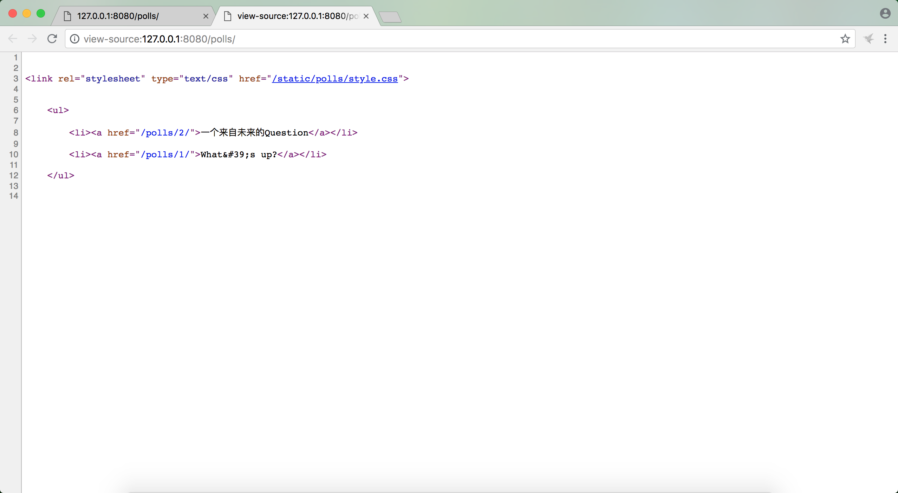

# django2docs

主编&作者:**蒋乐兴**

wechat:**jianglegege**

email:**1721900707@qq.com**

homepage:**http://www.sqlpy.com**

---
- [序言](#序言)
- [约定](#约定)
- [与静态文件相关的finder设置](#与静态文件相关的finder设置)
- [给app增加静态文件](#给app增加静态文件)
- [在模板中引用静态文件](#在模板中引用静态文件)
- [重新组织一下模板让它更加标准](#重新组织一下模板让它更加标准)
- [示例代码](#示例代码)

---


## 序言
   **对于一个页面来说除了html之外还有许多重要的部分，比如css js images 这样的静态文件；django也提供了一整套行之有效的办法来管理它们，和template一样也是通过finder来隔离不同位置的静态文件，由于finder做了隔离所以我们在引用的时候就变得统一了**

   这一切的背后都是通过` django.contrib.staticfiles`来完成的，默认情况下这个app已经激活了
   ```python
   INSTALLED_APPS = [
       'polls',
       'django.contrib.admin',
       'django.contrib.auth',
       'django.contrib.contenttypes',
       'django.contrib.sessions',
       'django.contrib.messages',
       'django.contrib.staticfiles', # 注意它在这里被激活了!
   ]

   ```

   ---

## 约定
   **django中约定所有的静态文件都保存在static目录下，这个static可以出现在你的项目目录下，也可以出现在你的app目录下，这都没有问题；因为到最后都是要通过finder来隔离的finder会根据这个约定去各个static目录下找静态文件**

   ---

## 与静态文件相关的finder设置
   **项目的settings.py文件中STATICFILES_FINDERS配置项用于设定finder的查找次序，一命中查找停止，所以要小心的组织静态文件因为会有覆盖的风险,它的默认值如下通常我们只要按约定来做就行了，可以不管这个配置项**
   ```python
   STATICFILES_FINDERS =[
       'django.contrib.staticfiles.finders.FileSystemFinder',
       'django.contrib.staticfiles.finders.AppDirectoriesFinder',
   ]
   ```
   ---

## 给app增加静态文件
   **1):** 创建用户保存静态的目录
   ```bash
   mkdir -p polls/static/polls/
   ```
   **2):** 创建css文件style.css
   ```bash
   touch polls/static/polls/style.css
   ```
   ```css
      li a {
       color: green;
   }
   ```

   ---

## 在模板中引用静态文件
   **1)** 在templates/polls/index.html中引用style.css
   ```html
   
   
   <link rel="stylesheet" type="text/css" href="">
   
   
       <ul>
       
           <li><a href="">{{ question.question_text }}</a></li>
       
       </ul>
   
       <p>No polls are available.</p>
   
   ```
   
   
   可以看到css生效了，列表的前景色已经变了，现在看一下前端代码是怎样体现的

   

   可以看到它是通过绝对路径直接引用的

   ---

## 重新组织一下模板让它更加标准
   ```html
   
   <!DOCTYPE html>
   <html>
       <head>
           <title>polls index page</title>
           <link rel="stylesheet" type="text/css" href="">
       </head>
       
       <body>
           
           <ul>
           
               <li><a href="">{{ question.question_text }}</a></li>
           
           </ul>
       
           <p>No polls are available.</p>
       
       </body>
   </html>

   ```
   渲染后的结果为
   ```html
   <!DOCTYPE html>
   <html>
       <head>
           <title>polls index page</title>
           <link rel="stylesheet" type="text/css" href="/static/polls/style.css">
       </head>
       
       <body>
           
           <ul>
           
               <li><a href="/polls/2/">一个来自未来的Question</a></li>
           
               <li><a href="/polls/1/">What&#39;s up?</a></li>
           
           </ul>
       
       </body>
   </html>
   ```

   ---

## 示例代码

   **1): Tutorials/codes/part6**

   ---