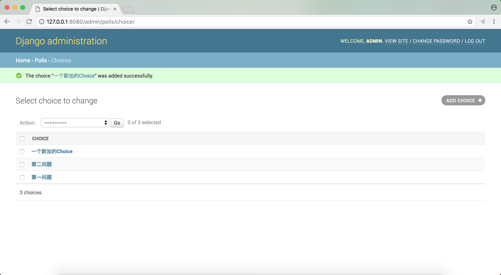

# django2docs

主编&作者:**蒋乐兴**

wechat:**jianglegege**

email:**1721900707@qq.com**

homepage:**http://www.sqlpy.com**

---

- [默认情况下admin页面的风格](#默认情况下admin页面的风格)
- [ModelAdmin调整字段次序](#ModelAdmin调整字段次序)
- [ModelAdmin字段集](#ModelAdmin字段集)
- [增加关联对象](#增加关联对象)
- [增加关联对象优化版](#增加关联对象优化版)
- [自定义Model的ChangeList](#自定义Model的ChangeList)
- [自定义admin站点](#自定义admin站点)
- [示例代码](#示例代码)
---


## 默认情况下admin页面的风格
   **默认情况下admin管理对象的注册代码**
   ```python
   from django.contrib import admin
   
   # Register your models here.
   from .models import Question,Choice
   
   admin.site.register(Question) # 把Question纳入admin站点的管理
   admin.site.register(Choice)   # 把Choice纳入admin站点的管理
   ```
   

   Question对象的增加页面如下

   

   **从上面的图像可以看到 question_text在pub_date字段的上面，如果我们想调整这个先后次序也就是说把pub_date放在question_text的前面，难道我们要去改Question这个model吗？如果是这样的话就扎心了我们的代码没有办法封闭；djanog的做法是引用一个新的适配器层(admin.ModelAdmin)**

   ---

## ModelAdmin调整字段次序
   **通过增加适配器层来调整字段的次序**
   ```python
   from django.contrib import admin
   
   # Register your models here.
   from .models import Question,Choice
   
   class QuestionAdmin(admin.ModelAdmin):
       """
       调整Question字段的默认次序由 question_text pub_date 到 pub_date question_text
       """
       fields = ['pub_date', 'question_text']
   
   
   admin.site.register(Question, QuestionAdmin) # 注册变更
   
   #admin.site.register(Question) # 把Question纳入admin站点的管理
   admin.site.register(Choice)   # 把Choice纳入admin站点的管理
   ```
   可以看到在注册对象的时候要多加一个参数把适配器对象也要加上去，适配器对象的fields列表可以指定列的次序

   

   上面的例子只有两个字段所以看出来调整次序有多大的优势，当字段数据上升到几十个字段的时候这个就非常有意义了。

   ---

## ModelAdmin字段集
   **在有几十个字段的情况下把字段数组成字段集是一个更加好的选择**
   ```python
   from django.contrib import admin
   
   # Register your models here.
   from .models import Question,Choice
   
   class QuestionAdmin(admin.ModelAdmin):
       fieldsets = [
           (None,               {'fields': ['question_text']}),
           ('Date information', {'fields': ['pub_date']}),
       ]
   
   admin.site.register(Question, QuestionAdmin)
   ```

   

   `fieldsets`是一个元组django用这样的数据结构来刻画字段集

   ---

## 增加关联对象
   **Choice是关联到Question的，django自己能处理这种外键引用的关系**

   
   
   点击SAVE保存新建的Choice对象

   

   这样一个个的加Choice早晚会累死的

   ---

## 增加关联对象优化版
   **默认情况下的增加关联对象效率上低的一个主要因素是它要在不同的页面上操作，我们现在可以把它统一到同一个页面上来**
   ```python
   from django.contrib import admin
   
   # Register your models here.
   from .models import Question,Choice
   
   class ChoiceInline(admin.StackedInline):
       model = Choice
       extra = 3
   
   
   class QuestionAdmin(admin.ModelAdmin):
       fieldsets = [
           (None,               {'fields': ['question_text']}),
           ('Date information', {'fields': ['pub_date'], 'classes': ['collapse']}),
       ]
       inlines = [ChoiceInline]
   
   admin.site.register(Question, QuestionAdmin)
   ```
   **1):** 可以直接编辑已有的Choice
   
   **2):** 可以在Question在页面上直接增加Choice
   

   问题还没有完由于各个Choice是纵向排列的，所以特别占空间

   ```python
   from django.contrib import admin
   
   # Register your models here.
   from .models import Question,Choice
   
   class ChoiceInline(admin.TabularInline):
       model = Choice
       extra = 3
   
   
   class QuestionAdmin(admin.ModelAdmin):
       fieldsets = [
           (None,               {'fields': ['question_text']}),
           ('Date information', {'fields': ['pub_date'], 'classes': ['collapse']}),
       ]
       inlines = [ChoiceInline]
   
   admin.site.register(Question, QuestionAdmin)
   ```
   

   ---

## 自定义Model的ChangeList
   **当前我的Question对象的ChangeList看起来就像这样**
   
   只能看到Question对象的question_text看不到其它信息,这个是因为Model对象是以__str__的返回显示的；admin.ModelAdmin可以改变这种默认的显示方式
   ```python
   from django.contrib import admin
   
   # Register your models here.
   from .models import Question,Choice
   class ChoiceInline(admin.TabularInline):
       model = Choice
       extra = 3
   
   
   class QuestionAdmin(admin.ModelAdmin):
       fieldsets = [
           (None,               {'fields': ['question_text']}),
           ('Date information', {'fields': ['pub_date'], 'classes': ['collapse']}),
       ]
       inlines = [ChoiceInline]
       list_display = ('question_text', 'pub_date')
   
   admin.site.register(Question, QuestionAdmin)
   ```
   

   **事实上amdin.ModelAdmin的list_display还可以包含Model对象中定义的方法**
   ```python
   from django.contrib import admin
   
   # Register your models here.
   from .models import Question,Choice
   
   class ChoiceInline(admin.TabularInline):
       model = Choice
       extra = 3
   
   
   class QuestionAdmin(admin.ModelAdmin):
       fieldsets = [
           (None,               {'fields': ['question_text']}),
           ('Date information', {'fields': ['pub_date'], 'classes': ['collapse']}),
       ]
       inlines = [ChoiceInline]
       list_display = ('question_text', 'pub_date','was_published_recently')
   
   admin.site.register(Question, QuestionAdmin)
   ```
   

   **问题还没有完全解决，如果Question的量特别大比如有几百个，那我要一个的找，找到什么时候能才找到呢？ 所以我们需要一个过虑的功能**
   ```python
   from django.contrib import admin
   
   # Register your models here.
   from .models import Question,Choice
   class ChoiceInline(admin.TabularInline):
       model = Choice
       extra = 3
   
   
   class QuestionAdmin(admin.ModelAdmin):
       fieldsets = [
           (None,               {'fields': ['question_text']}),
           ('Date information', {'fields': ['pub_date'], 'classes': ['collapse']}),
       ]
       inlines = [ChoiceInline]
       list_display = ('question_text', 'pub_date','was_published_recently')
       list_filter = ['pub_date'] #增加过滤项
   
   admin.site.register(Question, QuestionAdmin)
   ```
   

   list_filter 依赖于lis_display总的来说它还是不够强大，对于我们来说搜索通常是更加好的选择
   ```python
   from django.contrib import admin
   
   # Register your models here.
   from .models import Question,Choice
   
   class ChoiceInline(admin.TabularInline):
       model = Choice
       extra = 3
   
   
   class QuestionAdmin(admin.ModelAdmin):
       fieldsets = [
           (None,               {'fields': ['question_text']}),
           ('Date information', {'fields': ['pub_date'], 'classes': ['collapse']}),
       ]
       inlines = [ChoiceInline]
       list_display = ('question_text', 'pub_date','was_published_recently')
       list_filter = ['pub_date'] #根据pub_date过滤
       search_fields = ['question_text'] #根据question_text做搜索
   
   admin.site.register(Question, QuestionAdmin)
   ```
   

   ---

## 自定义admin站点
   **有没有觉得你每一次打开admin的时候都有一个Django Adminstration横在页面的最上面感到非常的不爽呢？整个django的admin站点都是通过template生成的，所以我们只要用自己的template模板覆盖掉系统自带的模板就可以自定义admin站点了**

   **1):** 默认情况下TEMPLATES的配置如下
   ```python
   TEMPLATES = [
       {
           'BACKEND': 'django.template.backends.django.DjangoTemplates',
           'DIRS': [],
           'APP_DIRS': True,
           'OPTIONS': {
               'context_processors': [
                   'django.template.context_processors.debug',
                   'django.template.context_processors.request',
                   'django.contrib.auth.context_processors.auth',
                   'django.contrib.messages.context_processors.messages',
               ],
           },
       },
   ]
   ```
   可以默认情况下django只从app目录下的templates目录加载模板，我们要加入另一项让它在项目目录下的templates目录加载模板
   ```python
   TEMPLATES = [
       {
           'BACKEND': 'django.template.backends.django.DjangoTemplates',
           'DIRS': [os.path.join(BASE_DIR, 'templates')], # 从项目下的templates目录加载模板
           'APP_DIRS': True,
           'OPTIONS': {
               'context_processors': [
                   'django.template.context_processors.debug',
                   'django.template.context_processors.request',
                   'django.contrib.auth.context_processors.auth',
                   'django.contrib.messages.context_processors.messages',
               ],
           },
       },
   ]
   ```
   **2):** 在项目目录下创建`templates/admin`目录
   ```bash
   mkdir -p templates/admin
   tree .
   ```
   ```bash
   ├── db.sqlite3
   ├── manage.py
   ├── mysite
   │   ├── __init__.py
   |   |...............
   │   └── wsgi.py
   ├── polls
   │   ├── __init__.py
   |   |............
   │   └── views.py
   └── templates
       └── admin
   ```
   **3):** 确定django的包在哪里
   ```
   python3 -c "import django; print(django.__path__)
   ```
   ```
   /Library/Frameworks/Python.framework/Versions/3.6/lib/python3.6/site-packages/django
   ```

   **4):** 拷贝admin/base_site.html文件到项目目录
   ```
   cp /Library/Frameworks/Python.framework/Versions/3.6/lib/python3.6/site-packages/django/contrib/admin/templates/admin/base_site.html templates/admin/
   ```
   admin/base_site.html的内容如下
   ```html
   
   
   {{ title }} | {{ site_title|default:_('Django site admin') }}
   
   
   <h1 id="site-name"><a href="">{{ site_header|default:_('Django administration') }}</a></h1>
   
   
   
   ```
   **5):** 改一个牛逼的名字吧
   ```
   
   
   {{ title }} | {{ site_title|default:_('Django site admin') }}
   
   
   <h1 id="site-name"><a href="">数据管理平台</a></h1>
   
   
   

   ```
   

   ---

## 示例代码

   **1): Tutorials/codes/part7**

   ---


